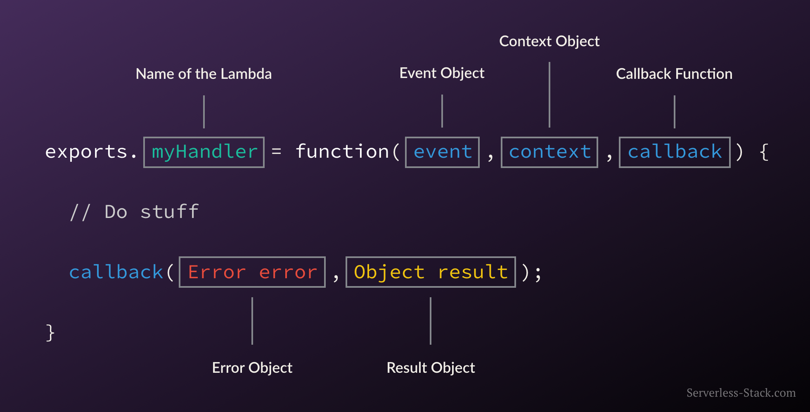
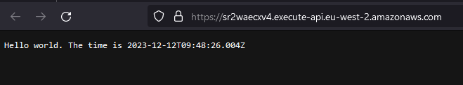
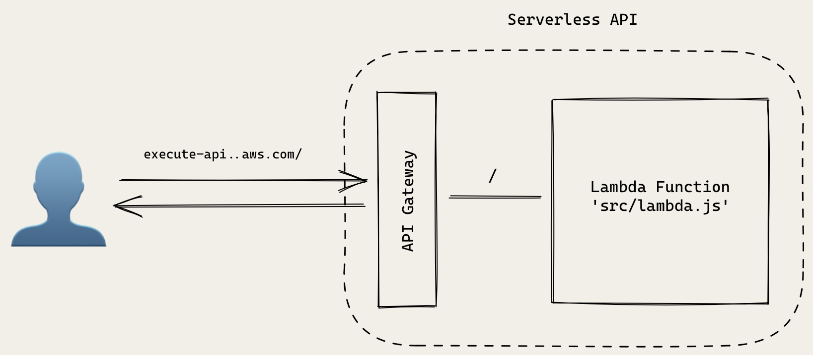
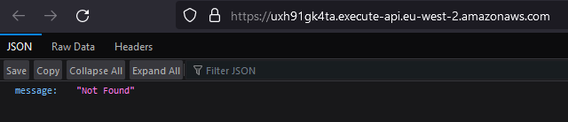

# SST

---

## Anatomy of a Lambda Function



---

### Create SST App using `notes` template

- `npm init sst notes`
- `cd notes`
- `npm install`

---

#### Adjust Region

in `sst.config.ts` change region to `eu-west-2`

```ts
// sst.config.ts
import { SSTConfig } from "sst";
import { API } from "./stacks/MyStack";

export default {
  config(_input) {
    return {
      name: "notes",
      region: "eu-west-2",
    };
  },
  stacks(app) {
    app.stack(API);
  },
} satisfies SSTConfig;
```

---

### An SST app is made up of two parts:

1. `stacks/` — **App Infrastructure**

   - The code that describes the infrastructure of your serverless app is placed in the `stacks/` directory of your project.
   - SST uses `AWS CDK`, to create the infrastructure.

2. `packages/` — **App Code**

   - The Lambda function code that’s run when your API is invoked is placed in the `packages/functions` directory of your project.
   - While `packages/core` contains our business logic.

- Our app is structured as a monorepo. Later on we’ll be adding a frontend/ directory for our React app.
- The starter project that’s created is defining a simple Hello World API.

---

### Create a Hello World API

- We are creating a simple API with one route, ` GET``  `/`.
- When this API is invoked, the function called handler in `packages/functions/src/lambda.ts` will be executed.

```ts
// stacks/MyStack.ts
import { StackContext, Api, EventBus } from "sst/constructs";

export function API({ stack }: StackContext) {
  const api = new Api(stack, "api", {
    routes: {
      "GET /": "packages/functions/src/lambda.handler",
    },
  });
  stack.addOutputs({
    ApiEndpoint: api.url,
  });
}
```

---

## Starting the `dev` environment

- `npm run dev`

- The first time you run this command it’ll ask you for the name of a `stage`.

- A `stage` or an `environment` is just a string that SST uses to namespace your deployments.

```bash
SST v2.38.4  ready!

➜  App:     notes
   Stage:   Baz
   Console: https://console.sst.dev/local/notes/Baz

⠏ Deploying bootstrap stack, this only needs to happen once
✔ Deploying bootstrap stack, this only needs to happen once
|  API PUBLISH_ASSETS_COMPLETE
|  API api/Api AWS::ApiGatewayV2::Api CREATE_COMPLETE
|  API api/LogGroup AWS::Logs::LogGroup CREATE_COMPLETE
|  API api/Parameter_url AWS::SSM::Parameter CREATE_COMPLETE
|  API api/Api/DefaultStage AWS::ApiGatewayV2::Stage CREATE_COMPLETE
|  API CustomResourceHandler/ServiceRole AWS::IAM::Role CREATE_COMPLETE
|  API api/Lambda_GET_--/ServiceRole AWS::IAM::Role CREATE_COMPLETE
|  API CustomResourceHandler AWS::Lambda::Function CREATE_COMPLETE
|  API api/Lambda_GET_--/ServiceRole/DefaultPolicy AWS::IAM::Policy CREATE_COMPLETE
|  API api/Lambda_GET_-- AWS::Lambda::Function CREATE_COMPLETE
|  API api/Route_GET_--/Integration_GET_-- AWS::ApiGatewayV2::Integration CREATE_COMPLETE
|  API api/Lambda_GET_--/EventInvokeConfig AWS::Lambda::EventInvokeConfig CREATE_COMPLETE
|  API api/Route_GET_-- AWS::Lambda::Permission CREATE_COMPLETE
|  API api/Route_GET_-- AWS::ApiGatewayV2::Route CREATE_COMPLETE
|  API AWS::CloudFormation::Stack CREATE_COMPLETE

✔  Deployed:
   API
   ApiEndpoint: https://sr2waecxv4.execute-api.eu-west-2.amazonaws.com
```

- Live API on AWS:



---

### Deploy to `prod`

- To deploy our API to production, we’ll need to stop our local development environment and run the following.

- `npm run deploy --prod`

- We don’t have to do this right now. We’ll be doing it later once we are done working on our app.

- The idea here is that we are able to work on separate environments. So when we are working in our personal environment `Baz`, it doesn’t break the API for our users in `prod`.

- The environment (or `stage`) names in this case are just strings and have no special significance. We could’ve called them `development` and `production` instead.

- We are however creating `completely new serverless apps when we deploy to a different environment`.

- This is another advantage of the serverless architecture.

- The infrastructure as code idea means that it’s easy to replicate to new environments.

- And the pay per use model means that we are not charged for these new environments unless we actually use them.

---

### Create a DynamoDB Table in SST

- We are now going to start creating our infrastructure in SST using AWS CDK.
- Starting with `DynamoDB`.

#### Create a Stack

Add a new file in `stacks/StorageStack.ts`

```ts
// stacks/StorageStack.ts
import { StackContext, Table } from "sst/constructs";

export function StorageStack({ stack }: StackContext) {
  // Create the DynamoDB table
  const table = new Table(stack, "Notes", {
    fields: {
      userId: "string",
      noteId: "string",
    },
    primaryIndex: { partitionKey: "userId", sortKey: "noteId" },
  });

  return {
    table,
  };
}
```

- We are creating a new `stack` in our SST app.
- We will be using it to create all our storage related infrastructure (`DynamoDB` and `S3`).
- There’s no specific reason why we are creating a separate `stack` for these resources.
- It’s only meant as a way of organizing our resources and **illustrating how to create separate stacks in our app**.

We are using SST’s Table construct to create our `DynamoDB` table.

It has two `fields`:

- `userId`: The id of the user that the note belongs to.
- `noteId`: The id of the note.

We are then creating an index for our table.

- Each `DynamoDB` table has a `primary key`.
- **`This cannot be changed once set`**.
- **`The primary key uniquely identifies each item in the table, so that no two items can have the same key.`**

- DynamoDB supports two different kinds of primary keys:
  - `Partition key`
  - `Partition key and sort key (composite)`

We are going to use the `composite primary key` (referenced by `primaryIndex` in code block above) which gives us additional flexibility when querying the data.

For example, if you provide only the `value` for `userId`, DynamoDB would retrieve **all of the notes by that user**.

Or you could provide a `value` for `userId` and a `value` for `noteId`, to retrieve a particular note.

We are also returning the Table that’s being created publicly.

```ts
return {
  table,
};
```

- **By explicitly returning the resources created in a stack, we can reference them in other stacks when we imported.**

---

### Remove Template Files

- In `sst.config.ts` we can remove the previous `API` stack
- And `import` and use the `StorageStack` we just created

```ts
// sst.config.ts
import { SSTConfig } from "sst";
// import { API } from "./stacks/MyStack";
import { StorageStack } from "./stacks/StorageStack";

export default {
  config(_input) {
    return {
      name: "notes",
      region: "eu-west-2",
    };
  },
  stacks(app) {
    app.stack(StorageStack);
  },
} satisfies SSTConfig;
```

---

### Deploy the App

- When we change the `sst.config.ts` and are running `npm run dev` the App updates

```bash
✔  Built

|  StorageStack PUBLISH_ASSETS_COMPLETE
|  StorageStack Notes/Table AWS::DynamoDB::Table CREATE_COMPLETE
|  StorageStack Notes/Parameter_tableName AWS::SSM::Parameter CREATE_COMPLETE
|  StorageStack CustomResourceHandler/ServiceRole AWS::IAM::Role CREATE_COMPLETE
|  StorageStack CustomResourceHandler AWS::Lambda::Function CREATE_COMPLETE
|  StorageStack AWS::CloudFormation::Stack CREATE_COMPLETE

✔  Deployed:
   StorageStack
```

---

### Create an S3 Bucket in SST

- We will create an `S3 Bucket` an add it the `StorageStack` that we created before
  - We import `Bucket` from `"sst/constructs"`
  - We instantiate a new bucket with `new Bucket` and add it add it **ABOVE** the `Table`
  - Then in the `StorageStack` `return` we add `bucket`
  - This will allow us to reference the `S3 bucket` in other `stacks`

```ts
// stacks/StorageStack.ts
import { StackContext, Bucket, Table } from "sst/constructs"; // import Bucket

export function StorageStack({ stack }: StackContext) {
  // Create an S3 Bucket
  const bucket = new Bucket(stack, "Uploads");

  // Create the DynamoDB table
  const table = new Table(stack, "Notes", {
    fields: {
      userId: "string",
      noteId: "string",
    },
    primaryIndex: { partitionKey: "userId", sortKey: "noteId" },
  });

  return {
    // return the bucket
    bucket,
    table,
  };
}
```

### Deploy the App

- We can see when we have updated the `StorageStack` it has deployed the `S3 Bucket`

```bash
✔  Built

|  StorageStack PUBLISH_ASSETS_COMPLETE
|  StorageStack Uploads/Bucket AWS::S3::Bucket CREATE_COMPLETE
|  StorageStack Uploads/Parameter_bucketName AWS::SSM::Parameter CREATE_COMPLETE
|  StorageStack Uploads/Bucket/Policy AWS::S3::BucketPolicy CREATE_COMPLETE
|  StorageStack AWS::CloudFormation::Stack UPDATE_COMPLETE
⠋  Deploying...

✔  Deployed:
   StorageStack
```

---

### Review

1. What we initially created `Hello World Public API`

- `API Gateway` handles our main `/` endpoint
- sending `GET` requests made to this to our default `services/functions/lambda.js` Lambda function



2. Our `Notes App Architecture` currently
   - with DynamoDB
   - with S3

- Our database is not exposed publicly and is only invoked by our Lambda functions
- But our users will be uploading files directly to the S3 bucket that we created


- **The second point is something that is different from a lot of traditional server based architectures.**
- We are typically used to uploading the files to our server and then moving them to a file server.
- But here we will be directly uploading it to our S3 bucket. We will look at this in more detail when we look at file uploads.
- In the coming sections will also be looking at how we can secure access to these resources.
- We will be setting it up such that only our authenticated users will be allowed to access these resources.

---

### Add an API to Create a Note

- Add an API to create a note.
- This API will take the `note object` as the `input` and store it in the `database` with a new `id`.
- The `note object` will contain the `content` field (the content of the note) and an `attachment` field (the URL to the uploaded file).

```ts
// stacks/ApiStack.ts

import { Api, StackContext, use } from "sst/constructs"; // import Api
import { StorageStack } from "./StorageStack";

export function ApiStack({ stack }: StackContext) {
  const { table } = use(StorageStack); // use the table from StorageStack

  // Create the API
  const api = new Api(stack, "Api", {
    defaults: {
      function: {
        bind: [table], // bind the table to our API
      },
    },
    routes: {
      // create a new POST /notes route
      "POST /notes": "packages/functions/src/create.main",
    },
  });

  // Show the API endpoint in the output
  stack.addOutputs({
    ApiEndpoint: api.url,
  });

  // Return the API resource
  return {
    api,
  };
}
```

- We are creating a new `stack` for our `API`. We could’ve used the stack we had previously created for DynamoDB and S3. But this is a good way to talk about how to share resources between stacks.
- This new `ApiStack` references the `table` resource from the StorageStack that we created previously.
- We are creating an `API` using SST’s `Api` `construct`.
- We are binding our DynamoDB table to our API using the `bind` `prop`. This will allow our API to access our table.
- The first route we are adding to our API is the `POST` `/notes` route. It’ll be used to create a note.
- Finally, we are printing out the URL of our API as an output by calling `stack.addOutputs`. **We are also exposing the API publicly so we can refer to it in other stacks.**

---

### Adding to the App

---

```ts
// sst.config.ts
import { SSTConfig } from "sst";
// import { API } from "./stacks/MyStack";
import { StorageStack } from "./stacks/StorageStack";
import { ApiStack } from "./stacks/ApiStack"; // import API Stack

export default {
  config(_input) {
    return {
      name: "notes",
      region: "eu-west-2",
    };
  },
  stacks(app) {
    // app.stack(StorageStack);
    app.stack(StorageStack).stack(ApiStack); // chain it onto app
  },
} satisfies SSTConfig;
```

```shell
✔  Built

|  StorageStack PUBLISH_ASSETS_COMPLETE
|  StorageStack AWS::CloudFormation::Stack UPDATE_COMPLETE
|  ApiStack PUBLISH_ASSETS_COMPLETE
|  ApiStack Api/Api AWS::ApiGatewayV2::Api CREATE_COMPLETE
|  ApiStack Api/LogGroup AWS::Logs::LogGroup CREATE_COMPLETE
|  ApiStack Api/Parameter_url AWS::SSM::Parameter CREATE_COMPLETE
|  ApiStack Api/Api/DefaultStage AWS::ApiGatewayV2::Stage CREATE_COMPLETE
|  ApiStack CustomResourceHandler/ServiceRole AWS::IAM::Role CREATE_COMPLETE
|  ApiStack Api/Lambda_POST_--notes/ServiceRole AWS::IAM::Role CREATE_COMPLETE
|  ApiStack CustomResourceHandler AWS::Lambda::Function CREATE_COMPLETE
|  ApiStack Api/Lambda_POST_--notes/ServiceRole/DefaultPolicy AWS::IAM::Policy CREATE_COMPLETE
|  ApiStack Api/Lambda_POST_--notes AWS::Lambda::Function CREATE_COMPLETE
|  ApiStack Api/Route_POST_--notes/Integration_POST_--notes AWS::ApiGatewayV2::Integration CREATE_COMPLETE
|  ApiStack Api/Lambda_POST_--notes/EventInvokeConfig AWS::Lambda::EventInvokeConfig CREATE_COMPLETE
|  ApiStack Api/Route_POST_--notes AWS::Lambda::Permission CREATE_COMPLETE
|  ApiStack Api/Route_POST_--notes AWS::ApiGatewayV2::Route CREATE_COMPLETE
|  ApiStack AWS::CloudFormation::Stack CREATE_COMPLETE

✔  Deployed:
   StorageStack
   ApiStack
   ApiEndpoint: https://uxh91gk4ta.execute-api.eu-west-2.amazonaws.com
```



---

### Add the Function to Create Note

- Parse the input from the `event.body`. This represents the HTTP request `body`.
- It contains the contents of the note, as a string — `content`.
- It also contains an `attachment`, if one exists. It’s the filename of a file that will be uploaded to our `S3 bucket`.
- We can access our `DynamoDB` table through `Table.Notes.tableName` from the `sst/node/table`, the SST Node.js client. Here `Notes` in `Table.Notes` is the name of our `Table` `construct` from the Create a DynamoDB Table in SST chapter. By doing `bind: [table]` earlier in this chapter, **we are allowing our API to access our table.**
- The `userId` is the id for the author of the note. For now we are hardcoding it to 123. Later we’ll be setting this based on the authenticated user.
- Make a call to `DynamoDB` to `put` a `new object` with a generated `noteId` and the current date as the createdAt.
- And if the `DynamoDB` call fails then return an error with the HTTP status code 500.

```ts
// packages/functions/src/create.ts
import AWS from "aws-sdk";
import * as uuid from "uuid";
import { APIGatewayProxyEvent } from "aws-lambda";
import { Table } from "sst/node/table";

const dynamoDb = new AWS.DynamoDB.DocumentClient();

export async function main(event: APIGatewayProxyEvent) {
  let data, params;

  // Request body is passed in as a JSON encoded string in 'event.body'
  if (event.body) {
    data = JSON.parse(event.body);
    params = {
      // "Notes" is the name of our table construct
      TableName: Table.Notes.tableName,
      Item: {
        // The attributes of the item to be created
        userId: "123",
        noteId: uuid.v1(),
        content: data.content,
        attachment: data.attachment,
        createdAt: Date.now(),
      },
    };
  } else {
    return {
      statusCode: 404,
      body: JSON.stringify({ error: true }),
    };
  }

  try {
    // try to PUT the new object into the Database
    await dynamoDb.put(params).promise();

    return {
      statusCode: 200,
      body: JSON.stringify(params.Item),
    };
  } catch (error) {
    let message;

    if (error instanceof Error) {
      message = error.message;
    } else {
      message = String(error);
    }

    return {
      statusCode: 500,
      body: JSON.stringify({ error: message }),
    };
  }
}
```

## Install the necessary packages in `packages/functions`

- ⚠️ In the `packages/functions` folder :

- `npm install --save aws-sdk aws-lambda uuid`
- `npm install --save-dev @types/aws-lambda @types/uuid`

## Test the API

```bash
curl -X POST \
-H 'Content-Type: application/json' \
-d '{"content":"Hello World","attachment":"hello.jpg"}' \
https://uxh91gk4ta.execute-api.eu-west-2.amazonaws.com//notes

{"userId":"123","noteId":"f1c46410-9905-11ee-b0a5-1d3f34358d8e","content":"Hello World","attachment":"hello.jpg","createdAt":1702396130513}
```

```bash
➜  App:     notes
   Stage:   Baz
   Console: https://console.sst.dev/local/notes/Baz

|  StorageStack PUBLISH_ASSETS_COMPLETE
   StorageStack
   ApiStack
   ApiEndpoint: https://uxh91gk4ta.execute-api.eu-west-2.amazonaws.com

|  Invoked packages/functions/src/create.main
|  Built packages/functions/src/create.main
|  Done in 3386ms

```

### Refactor `create.ts`

- Since we’ll be doing the same basic actions for all of our APIs, it makes sense to DRY our code to create **reusable shared behaviors** for both application reliability and maintainability.

```ts
// packages/functions/src/create.ts
import * as uuid from "uuid";
import { Table } from "sst/node/table";
import handler from "@notes/core/handler";
import dynamoDb from "@notes/core/dynamodb";

export const main = handler(async (event) => {
  let data = {
    content: "",
    attachment: "",
  };

  if (event.body != null) {
    data = JSON.parse(event.body);
  }

  const params = {
    TableName: Table.Notes.tableName,
    Item: {
      // The attributes of the item to be created
      userId: "123", // The id of the author
      noteId: uuid.v1(), // A unique uuid
      content: data.content, // Parsed from request body
      attachment: data.attachment, // Parsed from request body
      createdAt: Date.now(), // Current Unix timestamp
    },
  };

  await dynamoDb.put(params);

  return JSON.stringify(params.Item);
});
```

- We want to make our Lambda function async, and simply return the results.
- We want to simplify how we make calls to DynamoDB. We don’t want to have to create a new AWS.DynamoDB.DocumentClient().
- We want to centrally handle any errors in our Lambda functions.
- Finally, since all of our Lambda functions will be handling API endpoints, we want to handle our HTTP responses in one place.

### Create `packages/core/src/dynamodb.ts`

- Let’s start by creating a `dynamodb` `util` that we can share across all our functions.
- We’ll place this in the `packages/core` directory.
- This is where we’ll be putting all our business logic.

- Here we are creating a convenience object that exposes the DynamoDB client methods that we are going to need in this guide.

```ts
// packages/core/src/dynamodb.ts
import AWS from "aws-sdk";
import { DocumentClient } from "aws-sdk/lib/dynamodb/document_client";

const client = new AWS.DynamoDB.DocumentClient();

export default {
  get: (params: DocumentClient.GetItemInput) => client.get(params).promise(),
  put: (params: DocumentClient.PutItemInput) => client.put(params).promise(),
  query: (params: DocumentClient.QueryInput) => client.query(params).promise(),
  update: (params: DocumentClient.UpdateItemInput) =>
    client.update(params).promise(),
  delete: (params: DocumentClient.DeleteItemInput) =>
    client.delete(params).promise(),
};
```

### Create `packages/core/src/handler.ts`

- We are creating a handler function that we’ll use as a wrapper around our Lambda functions.
- It takes our Lambda function as the argument.
- We then run the Lambda function in a try/catch block.
- On success, we take the result and return it with a 200 status code.
- If there is an error then we return the error message with a 500 status code.

```ts
// packages/core/src/handler.ts
import { Context, APIGatewayProxyEvent } from "aws-lambda";

export default function handler(
  lambda: (evt: APIGatewayProxyEvent, context: Context) => Promise<string>
) {
  return async function (event: APIGatewayProxyEvent, context: Context) {
    let body, statusCode;

    try {
      // Run the Lambda
      body = await lambda(event, context);
      statusCode = 200;
    } catch (error) {
      statusCode = 500;
      body = JSON.stringify({
        error: error instanceof Error ? error.message : String(error),
      });
    }

    // Return HTTP response
    return {
      body,
      statusCode,
    };
  };
}
```

### Install the necessary packages in `packages/core`

- ⚠️ In the `packages/core` folder :

- `npm install --save aws-sdk aws-lambda`
- `npm install --save-dev @types/aws-lambda`

---

### Add an API to Get a Note

- Now that we created a note and saved it to our database, let’s add an API to retrieve a note given its id.

### Add the Function

- Create `packages/functions/src/get.ts`

- This follows exactly the same structure as our previous `create.ts`` function.
- The major difference here is that we are doing a `dynamoDb.get(params)` to get a `note object` given the `userId` (still hardcoded) and `noteId` that’s passed in through the request.

```ts
// packages/functions/src/get.ts
import { Table } from "sst/node/table";
import handler from "@notes/core/handler";
import dynamoDb from "@notes/core/dynamodb";

export const main = handler(async (event) => {
  const params = {
    TableName: Table.Notes.tableName,
    // 'Key' defines the partition key and sort key of
    // the item to be retrieved
    Key: {
      userId: "123", // The id of the author
      noteId: event?.pathParameters?.id, // The id of the note from the path
    },
  };

  const result = await dynamoDb.get(params);
  if (!result.Item) {
    throw new Error("Item not found.");
  }

  // Return the retrieved item
  return JSON.stringify(result.Item);
});
```

---

### Add the Route

- In `stacks/ApiStack.ts` we add to the `routes` object a key/value pair `"GET /notes/{id}": "packages/functions/src/get.main"`

```ts
// stacks/ApiStack.ts
import { Api, StackContext, use } from "sst/constructs";
import { StorageStack } from "./StorageStack";

export function ApiStack({ stack }: StackContext) {
  const { table } = use(StorageStack);

  const api = new Api(stack, "Api", {
    defaults: {
      function: {
        bind: [table],
      },
    },
    routes: {
      "POST /notes": "packages/functions/src/create.main",
      // create a new GET /notes/{id} route
      "GET /notes/{id}": "packages/functions/src/get.main",
    },
  });

  stack.addOutputs({
    ApiEndpoint: api.url,
  });

  return {
    api,
  };
}
```

```bash
✔  Built

|  StorageStack PUBLISH_ASSETS_COMPLETE
|  ApiStack PUBLISH_ASSETS_COMPLETE
|  ApiStack Api/Lambda_GET_--notes--{id}/ServiceRole AWS::IAM::Role CREATE_COMPLETE
|  ApiStack Api/Lambda_GET_--notes--{id}/ServiceRole/DefaultPolicy AWS::IAM::Policy CREATE_COMPLETE

|  ApiStack Api/Lambda_GET_--notes--{id} AWS::Lambda::Function CREATE_COMPLETE
|  ApiStack Api/Route_GET_--notes--{id}/Integration_GET_--notes--{id} AWS::ApiGatewayV2::Integration CREATE_COMPLETE
|  ApiStack Api/Lambda_GET_--notes--{id}/EventInvokeConfig AWS::Lambda::EventInvokeConfig CREATE_COMPLETE
|  ApiStack Api/Route_GET_--notes--{id} AWS::Lambda::Permission CREATE_COMPLETE
|  ApiStack Api/Route_GET_--notes--{id} AWS::ApiGatewayV2::Route CREATE_COMPLETE
|  ApiStack AWS::CloudFormation::Stack UPDATE_COMPLETE

✔  Deployed:
   StorageStack
   ApiStack
   ApiEndpoint: https://uxh91gk4ta.execute-api.eu-west-2.amazonaws.com
```

### Test the API

```bash
curl https://uxh91gk4ta.execute-api.eu-west-2.amazonaws.com/notes/f1c46410-9905-11ee-b0a5-1d3f34358d8e

{"attachment":"hello.jpg","content":"Hello World","createdAt":1702396130513,"noteId":"f1c46410-9905-11ee-b0a5-1d3f34358d8e","userId":"123"}
```

```bash
|  Invoked packages/functions/src/get.main
|  Built packages/functions/src/get.main
|  Done in 2548ms
```

---

### Add an API to List All the Notes

- Add an API that returns a list of all the notes a user has to `packages/functions/src/list.ts`
- This is pretty much the same as our `get.ts` except we use a condition to only return the items that have the same `userId` as the one we are passing in.

```ts
// packages/functions/src/list.ts
import { Table } from "sst/node/table";
import handler from "@notes/core/handler";
import dynamoDb from "@notes/core/dynamodb";

export const main = handler(async (event) => {
  const params = {
    TableName: Table.Notes.tableName,
    // 'KeyConditionExpression' defines the condition for the query
    // - 'userId = :userId': only return items with matching 'userId'
    //   partition key
    KeyConditionExpression: "userId = :userId",
    // 'ExpressionAttributeValues' defines the value in the condition
    // - ':userId': defines 'userId' to be the id of the author
    ExpressionAttributeValues: {
      ":userId": "123",
    },
  };

  const result = await dynamoDb.query(params);

  // Return the matching list of items in response body
  return JSON.stringify(result.Items);
});
```

### Add the Route

- In `stacks/ApiStack.ts` we add to the `routes` object a key/value pair `"GET /notes": "packages/functions/src/list.main",`

```ts
import { Api, StackContext, use } from "sst/constructs";
import { StorageStack } from "./StorageStack";

export function ApiStack({ stack }: StackContext) {
  const { table } = use(StorageStack);

  // Create the API
  const api = new Api(stack, "Api", {
    defaults: {
      function: {
        bind: [table],
      },
    },
    routes: {
      "POST /notes": "packages/functions/src/create.main",
      "GET /notes/{id}": "packages/functions/src/get.main",
      // create a new GET /notes route (to get all notes)
      "GET /notes": "packages/functions/src/list.main",
    },
  });

  stack.addOutputs({
    ApiEndpoint: api.url,
  });

  return {
    api,
  };
}
```

### Test the API

- We get back an Array of Notes

```bash
curl https://uxh91gk4ta.execute-api.eu-west-2.amazonaws.com/notes

[{"attachment":"hello.jpg","content":"Hello World","createdAt":1702396130513,"noteId":"f1c46410-9905-11ee-b0a5-1d3f34358d8e","userId":"123"},{"attachment":"hello.jpg","content":"Hello World","createdAt":1702398301821,"noteId":"fff7b2d0-990a-11ee-b964-a919c44c56a1","userId":"123"}]
```

```bash
|  Invoked packages/functions/src/list.main
|  Built packages/functions/src/list.main
|  Done in 1887ms
```

---
