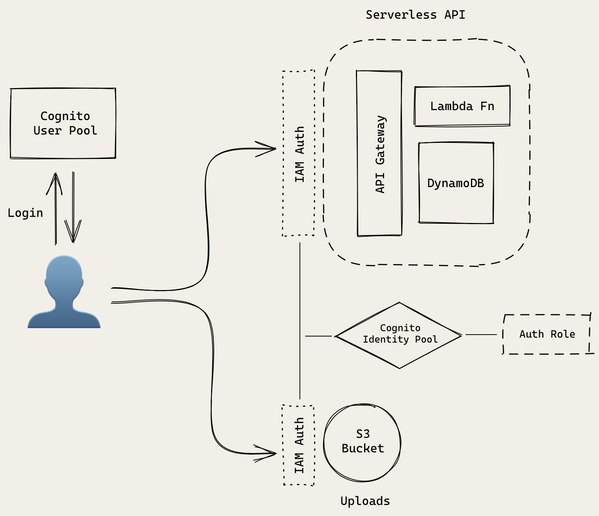

# SST

https://sst.dev/

---

### Anatomy of a Lambda Function


---

### Create SST App using `notes` template

- `npm init sst notes`
- `cd notes`
- `npm install`

---

#### Adjust Region

in `sst.config.ts` change region to `eu-west-2`

```ts
// sst.config.ts
import { SSTConfig } from "sst";
import { API } from "./stacks/MyStack";

export default {
  config(_input) {
    return {
      name: "notes",
      region: "eu-west-2",
    };
  },
  stacks(app) {
    app.stack(API);
  },
} satisfies SSTConfig;
```

---

### An SST app is made up of two parts:

1. `stacks/` — **App Infrastructure**

   - The code that describes the infrastructure of your serverless app is placed in the `stacks/` directory of your project.
   - SST uses `AWS CDK`, to create the infrastructure.

2. `packages/` — **App Code**

   - The Lambda function code that’s run when your API is invoked is placed in the `packages/functions` directory of your project.
   - While `packages/core` contains our business logic.

- Our app is structured as a monorepo. Later on we’ll be adding a frontend/ directory for our React app.
- The starter project that’s created is defining a simple Hello World API.

---

### Create a Hello World API

- We are creating a simple API with one route, ` GET``  `/`.
- When this API is invoked, the function called handler in `packages/functions/src/lambda.ts` will be executed.

```ts
// stacks/MyStack.ts
import { StackContext, Api, EventBus } from "sst/constructs";

export function API({ stack }: StackContext) {
  const api = new Api(stack, "api", {
    routes: {
      "GET /": "packages/functions/src/lambda.handler",
    },
  });
  stack.addOutputs({
    ApiEndpoint: api.url,
  });
}
```

---

## Starting the `dev` environment

- `npm run dev`

- The first time you run this command it’ll ask you for the name of a `stage`.

- A `stage` or an `environment` is just a string that SST uses to namespace your deployments.

```bash
SST v2.38.4  ready!

➜  App:     notes
   Stage:   Baz
   Console: https://console.sst.dev/local/notes/Baz

⠏ Deploying bootstrap stack, this only needs to happen once
✔ Deploying bootstrap stack, this only needs to happen once
|  API PUBLISH_ASSETS_COMPLETE
|  API api/Api AWS::ApiGatewayV2::Api CREATE_COMPLETE
|  API api/LogGroup AWS::Logs::LogGroup CREATE_COMPLETE
|  API api/Parameter_url AWS::SSM::Parameter CREATE_COMPLETE
|  API api/Api/DefaultStage AWS::ApiGatewayV2::Stage CREATE_COMPLETE
|  API CustomResourceHandler/ServiceRole AWS::IAM::Role CREATE_COMPLETE
|  API api/Lambda_GET_--/ServiceRole AWS::IAM::Role CREATE_COMPLETE
|  API CustomResourceHandler AWS::Lambda::Function CREATE_COMPLETE
|  API api/Lambda_GET_--/ServiceRole/DefaultPolicy AWS::IAM::Policy CREATE_COMPLETE
|  API api/Lambda_GET_-- AWS::Lambda::Function CREATE_COMPLETE
|  API api/Route_GET_--/Integration_GET_-- AWS::ApiGatewayV2::Integration CREATE_COMPLETE
|  API api/Lambda_GET_--/EventInvokeConfig AWS::Lambda::EventInvokeConfig CREATE_COMPLETE
|  API api/Route_GET_-- AWS::Lambda::Permission CREATE_COMPLETE
|  API api/Route_GET_-- AWS::ApiGatewayV2::Route CREATE_COMPLETE
|  API AWS::CloudFormation::Stack CREATE_COMPLETE

✔  Deployed:
   API
   ApiEndpoint: https://sr2waecxv4.execute-api.eu-west-2.amazonaws.com
```

- Live API on AWS:


---

### Deploy to `prod`

- To deploy our API to production, we’ll need to stop our local development environment and run the following.

- `npm run deploy --prod`

- We don’t have to do this right now. We’ll be doing it later once we are done working on our app.

- The idea here is that we are able to work on separate environments. So when we are working in our personal environment `Baz`, it doesn’t break the API for our users in `prod`.

- The environment (or `stage`) names in this case are just strings and have no special significance. We could’ve called them `development` and `production` instead.

- We are however creating `completely new serverless apps when we deploy to a different environment`.

- This is another advantage of the serverless architecture.

- The infrastructure as code idea means that it’s easy to replicate to new environments.

- And the pay per use model means that we are not charged for these new environments unless we actually use them.

---

### Create a DynamoDB Table in SST

- We are now going to start creating our infrastructure in SST using AWS CDK.
- Starting with `DynamoDB`.

#### Create a Stack

Add a new file in `stacks/StorageStack.ts`

```ts
// stacks/StorageStack.ts
import { StackContext, Table } from "sst/constructs";

export function StorageStack({ stack }: StackContext) {
  // Create the DynamoDB table
  const table = new Table(stack, "Notes", {
    fields: {
      userId: "string",
      noteId: "string",
    },
    primaryIndex: { partitionKey: "userId", sortKey: "noteId" },
  });

  return {
    table,
  };
}
```

- We are creating a new `stack` in our SST app.
- We will be using it to create all our storage related infrastructure (`DynamoDB` and `S3`).
- There’s no specific reason why we are creating a separate `stack` for these resources.
- It’s only meant as a way of organizing our resources and **illustrating how to create separate stacks in our app**.

We are using SST’s Table construct to create our `DynamoDB` table.

It has two `fields`:

- `userId`: The id of the user that the note belongs to.
- `noteId`: The id of the note.

We are then creating an index for our table.

- Each `DynamoDB` table has a `primary key`.
- **`This cannot be changed once set`**.
- **`The primary key uniquely identifies each item in the table, so that no two items can have the same key.`**

- DynamoDB supports two different kinds of primary keys:
  - `Partition key`
  - `Partition key and sort key (composite)`

We are going to use the `composite primary key` (referenced by `primaryIndex` in code block above) which gives us additional flexibility when querying the data.

For example, if you provide only the `value` for `userId`, DynamoDB would retrieve **all of the notes by that user**.

Or you could provide a `value` for `userId` and a `value` for `noteId`, to retrieve a particular note.

We are also returning the Table that’s being created publicly.

```ts
return {
  table,
};
```

- **By explicitly returning the resources created in a stack, we can reference them in other stacks when we imported.**

---

### Remove Template Files

- In `sst.config.ts` we can remove the previous `API` stack
- And `import` and use the `StorageStack` we just created

```ts
// sst.config.ts
import { SSTConfig } from "sst";
// import { API } from "./stacks/MyStack";
import { StorageStack } from "./stacks/StorageStack";

export default {
  config(_input) {
    return {
      name: "notes",
      region: "eu-west-2",
    };
  },
  stacks(app) {
    app.stack(StorageStack);
  },
} satisfies SSTConfig;
```

---

### Deploy the App

- When we change the `sst.config.ts` and are running `npm run dev` the App updates

```bash
✔  Built

|  StorageStack PUBLISH_ASSETS_COMPLETE
|  StorageStack Notes/Table AWS::DynamoDB::Table CREATE_COMPLETE
|  StorageStack Notes/Parameter_tableName AWS::SSM::Parameter CREATE_COMPLETE
|  StorageStack CustomResourceHandler/ServiceRole AWS::IAM::Role CREATE_COMPLETE
|  StorageStack CustomResourceHandler AWS::Lambda::Function CREATE_COMPLETE
|  StorageStack AWS::CloudFormation::Stack CREATE_COMPLETE

✔  Deployed:
   StorageStack
```

---

### Create an S3 Bucket in SST

- We will create an `S3 Bucket` an add it the `StorageStack` that we created before
  - We import `Bucket` from `"sst/constructs"`
  - We instantiate a new bucket with `new Bucket` and add it add it **ABOVE** the `Table`
  - Then in the `StorageStack` `return` we add `bucket`
  - This will allow us to reference the `S3 bucket` in other `stacks`

```ts
// stacks/StorageStack.ts
import { StackContext, Bucket, Table } from "sst/constructs"; // import Bucket

export function StorageStack({ stack }: StackContext) {
  // Create an S3 Bucket
  const bucket = new Bucket(stack, "Uploads");

  // Create the DynamoDB table
  const table = new Table(stack, "Notes", {
    fields: {
      userId: "string",
      noteId: "string",
    },
    primaryIndex: { partitionKey: "userId", sortKey: "noteId" },
  });

  return {
    // return the bucket
    bucket,
    table,
  };
}
```

### Deploy the App

- We can see when we have updated the `StorageStack` it has deployed the `S3 Bucket`

```bash
✔  Built

|  StorageStack PUBLISH_ASSETS_COMPLETE
|  StorageStack Uploads/Bucket AWS::S3::Bucket CREATE_COMPLETE
|  StorageStack Uploads/Parameter_bucketName AWS::SSM::Parameter CREATE_COMPLETE
|  StorageStack Uploads/Bucket/Policy AWS::S3::BucketPolicy CREATE_COMPLETE
|  StorageStack AWS::CloudFormation::Stack UPDATE_COMPLETE
⠋  Deploying...

✔  Deployed:
   StorageStack
```

---

### Review

1. What we initially created `Hello World Public API`

- `API Gateway` handles our main `/` endpoint
- sending `GET` requests made to this to our default `services/functions/lambda.js` Lambda function


2. Our `Notes App Architecture` currently
   - with DynamoDB
   - with S3

- Our database is not exposed publicly and is only invoked by our Lambda functions
- But our users will be uploading files directly to the S3 bucket that we created


- **The second point is something that is different from a lot of traditional server based architectures.**
- We are typically used to uploading the files to our server and then moving them to a file server.
- But here we will be directly uploading it to our S3 bucket. We will look at this in more detail when we look at file uploads.
- In the coming sections will also be looking at how we can secure access to these resources.
- We will be setting it up such that only our authenticated users will be allowed to access these resources.

---

### Add an API to Create a Note

- Add an API to create a note.
- This API will take the `note object` as the `input` and store it in the `database` with a new `id`.
- The `note object` will contain the `content` field (the content of the note) and an `attachment` field (the URL to the uploaded file).

```ts
// stacks/ApiStack.ts

import { Api, StackContext, use } from "sst/constructs"; // import Api
import { StorageStack } from "./StorageStack";

export function ApiStack({ stack }: StackContext) {
  const { table } = use(StorageStack); // use the table from StorageStack

  // Create the API
  const api = new Api(stack, "Api", {
    defaults: {
      function: {
        bind: [table], // bind the table to our API
      },
    },
    routes: {
      // create a POST /notes route
      "POST /notes": "packages/functions/src/create.main",
    },
  });

  // Show the API endpoint in the output
  stack.addOutputs({
    ApiEndpoint: api.url,
  });

  // Return the API resource
  return {
    api,
  };
}
```

- We are creating a new `stack` for our `API`. We could’ve used the stack we had previously created for DynamoDB and S3. But this is a good way to talk about how to share resources between stacks.
- This new `ApiStack` references the `table` resource from the StorageStack that we created previously.
- We are creating an `API` using SST’s `Api` `construct`.
- We are binding our DynamoDB table to our API using the `bind` `prop`. This will allow our API to access our table.
- The first route we are adding to our API is the `POST` `/notes` route. It’ll be used to create a note.
- Finally, we are printing out the URL of our API as an output by calling `stack.addOutputs`. **We are also exposing the API publicly so we can refer to it in other stacks.**

---

### Adding to the App

---

```ts
// sst.config.ts
import { SSTConfig } from "sst";
// import { API } from "./stacks/MyStack";
import { StorageStack } from "./stacks/StorageStack";
import { ApiStack } from "./stacks/ApiStack"; // import API Stack

export default {
  config(_input) {
    return {
      name: "notes",
      region: "eu-west-2",
    };
  },
  stacks(app) {
    // app.stack(StorageStack);
    app.stack(StorageStack).stack(ApiStack); // chain it onto app
  },
} satisfies SSTConfig;
```

```shell
✔  Built

|  StorageStack PUBLISH_ASSETS_COMPLETE
|  StorageStack AWS::CloudFormation::Stack UPDATE_COMPLETE
|  ApiStack PUBLISH_ASSETS_COMPLETE
|  ApiStack Api/Api AWS::ApiGatewayV2::Api CREATE_COMPLETE
|  ApiStack Api/LogGroup AWS::Logs::LogGroup CREATE_COMPLETE
|  ApiStack Api/Parameter_url AWS::SSM::Parameter CREATE_COMPLETE
|  ApiStack Api/Api/DefaultStage AWS::ApiGatewayV2::Stage CREATE_COMPLETE
|  ApiStack CustomResourceHandler/ServiceRole AWS::IAM::Role CREATE_COMPLETE
|  ApiStack Api/Lambda_POST_--notes/ServiceRole AWS::IAM::Role CREATE_COMPLETE
|  ApiStack CustomResourceHandler AWS::Lambda::Function CREATE_COMPLETE
|  ApiStack Api/Lambda_POST_--notes/ServiceRole/DefaultPolicy AWS::IAM::Policy CREATE_COMPLETE
|  ApiStack Api/Lambda_POST_--notes AWS::Lambda::Function CREATE_COMPLETE
|  ApiStack Api/Route_POST_--notes/Integration_POST_--notes AWS::ApiGatewayV2::Integration CREATE_COMPLETE
|  ApiStack Api/Lambda_POST_--notes/EventInvokeConfig AWS::Lambda::EventInvokeConfig CREATE_COMPLETE
|  ApiStack Api/Route_POST_--notes AWS::Lambda::Permission CREATE_COMPLETE
|  ApiStack Api/Route_POST_--notes AWS::ApiGatewayV2::Route CREATE_COMPLETE
|  ApiStack AWS::CloudFormation::Stack CREATE_COMPLETE

✔  Deployed:
   StorageStack
   ApiStack
   ApiEndpoint: https://uxh91gk4ta.execute-api.eu-west-2.amazonaws.com
```


---

### Add the Function to Create Note

- Parse the input from the `event.body`. This represents the HTTP request `body`.
- It contains the contents of the note, as a string — `content`.
- It also contains an `attachment`, if one exists. It’s the filename of a file that will be uploaded to our `S3 bucket`.
- We can access our `DynamoDB` table through `Table.Notes.tableName` from the `sst/node/table`, the SST Node.js client. Here `Notes` in `Table.Notes` is the name of our `Table` `construct` from the Create a DynamoDB Table in SST chapter. By doing `bind: [table]` earlier in this chapter, **we are allowing our API to access our table.**
- The `userId` is the id for the author of the note. For now we are hardcoding it to 123. Later we’ll be setting this based on the authenticated user.
- Make a call to `DynamoDB` to `put` a `new object` with a generated `noteId` and the current date as the createdAt.
- And if the `DynamoDB` call fails then return an error with the HTTP status code 500.

```ts
// packages/functions/src/create.ts
import AWS from "aws-sdk";
import * as uuid from "uuid";
import { APIGatewayProxyEvent } from "aws-lambda";
import { Table } from "sst/node/table";

const dynamoDb = new AWS.DynamoDB.DocumentClient();

export async function main(event: APIGatewayProxyEvent) {
  let data, params;

  // Request body is passed in as a JSON encoded string in 'event.body'
  if (event.body) {
    data = JSON.parse(event.body);
    params = {
      // "Notes" is the name of our table construct
      TableName: Table.Notes.tableName,
      Item: {
        // The attributes of the item to be created
        userId: "123",
        noteId: uuid.v1(),
        content: data.content,
        attachment: data.attachment,
        createdAt: Date.now(),
      },
    };
  } else {
    return {
      statusCode: 404,
      body: JSON.stringify({ error: true }),
    };
  }

  try {
    // try to PUT the new object into the Database
    await dynamoDb.put(params).promise();

    return {
      statusCode: 200,
      body: JSON.stringify(params.Item),
    };
  } catch (error) {
    let message;

    if (error instanceof Error) {
      message = error.message;
    } else {
      message = String(error);
    }

    return {
      statusCode: 500,
      body: JSON.stringify({ error: message }),
    };
  }
}
```

## Install the necessary packages in `packages/functions`

- ⚠️ In the `packages/functions` folder :

- `npm install --save aws-sdk aws-lambda uuid`
- `npm install --save-dev @types/aws-lambda @types/uuid`

## Test the API

```bash
curl -X POST \
-H 'Content-Type: application/json' \
-d '{"content":"Hello World","attachment":"hello.jpg"}' \
https://uxh91gk4ta.execute-api.eu-west-2.amazonaws.com//notes

{"userId":"123","noteId":"f1c46410-9905-11ee-b0a5-1d3f34358d8e","content":"Hello World","attachment":"hello.jpg","createdAt":1702396130513}
```

```bash
➜  App:     notes
   Stage:   Baz
   Console: https://console.sst.dev/local/notes/Baz

|  StorageStack PUBLISH_ASSETS_COMPLETE
   StorageStack
   ApiStack
   ApiEndpoint: https://uxh91gk4ta.execute-api.eu-west-2.amazonaws.com

|  Invoked packages/functions/src/create.main
|  Built packages/functions/src/create.main
|  Done in 3386ms

```

### Refactor `create.ts`

- Since we’ll be doing the same basic actions for all of our APIs, it makes sense to DRY our code to create **reusable shared behaviors** for both application reliability and maintainability.

```ts
// packages/functions/src/create.ts
import * as uuid from "uuid";
import { Table } from "sst/node/table";
import handler from "@notes/core/handler";
import dynamoDb from "@notes/core/dynamodb";

export const main = handler(async (event) => {
  let data = {
    content: "",
    attachment: "",
  };

  if (event.body != null) {
    data = JSON.parse(event.body);
  }

  const params = {
    TableName: Table.Notes.tableName,
    Item: {
      // The attributes of the item to be created
      userId: "123", // The id of the author
      noteId: uuid.v1(), // A unique uuid
      content: data.content, // Parsed from request body
      attachment: data.attachment, // Parsed from request body
      createdAt: Date.now(), // Current Unix timestamp
    },
  };

  await dynamoDb.put(params);

  return JSON.stringify(params.Item);
});
```

- We want to make our Lambda function async, and simply return the results.
- We want to simplify how we make calls to DynamoDB. We don’t want to have to create a new AWS.DynamoDB.DocumentClient().
- We want to centrally handle any errors in our Lambda functions.
- Finally, since all of our Lambda functions will be handling API endpoints, we want to handle our HTTP responses in one place.

### Create `packages/core/src/dynamodb.ts`

- Let’s start by creating a `dynamodb` `util` that we can share across all our functions.
- We’ll place this in the `packages/core` directory.
- This is where we’ll be putting all our business logic.

- Here we are creating a convenience object that exposes the DynamoDB client methods that we are going to need in this guide.

```ts
// packages/core/src/dynamodb.ts
import AWS from "aws-sdk";
import { DocumentClient } from "aws-sdk/lib/dynamodb/document_client";

const client = new AWS.DynamoDB.DocumentClient();

export default {
  get: (params: DocumentClient.GetItemInput) => client.get(params).promise(),
  put: (params: DocumentClient.PutItemInput) => client.put(params).promise(),
  query: (params: DocumentClient.QueryInput) => client.query(params).promise(),
  update: (params: DocumentClient.UpdateItemInput) =>
    client.update(params).promise(),
  delete: (params: DocumentClient.DeleteItemInput) =>
    client.delete(params).promise(),
};
```

### Create `packages/core/src/handler.ts`

- We are creating a handler function that we’ll use as a wrapper around our Lambda functions.
- It takes our Lambda function as the argument.
- We then run the Lambda function in a try/catch block.
- On success, we take the result and return it with a 200 status code.
- If there is an error then we return the error message with a 500 status code.

```ts
// packages/core/src/handler.ts
import { Context, APIGatewayProxyEvent } from "aws-lambda";

export default function handler(
  lambda: (evt: APIGatewayProxyEvent, context: Context) => Promise<string>
) {
  return async function (event: APIGatewayProxyEvent, context: Context) {
    let body, statusCode;

    try {
      // Run the Lambda
      body = await lambda(event, context);
      statusCode = 200;
    } catch (error) {
      statusCode = 500;
      body = JSON.stringify({
        error: error instanceof Error ? error.message : String(error),
      });
    }

    // Return HTTP response
    return {
      body,
      statusCode,
    };
  };
}
```

### Install the necessary packages in `packages/core`

- ⚠️ In the `packages/core` folder :

- `npm install --save aws-sdk aws-lambda`
- `npm install --save-dev @types/aws-lambda`

---

### Add an API to Get a Note

- Now that we created a note and saved it to our database, let’s add an API to retrieve a note given its id.

### Add the Function

- Create `packages/functions/src/get.ts`

- This follows exactly the same structure as our previous `create.ts`` function.
- The major difference here is that we are doing a `dynamoDb.get(params)` to get a `note object` given the `userId` (still hardcoded) and `noteId` that’s passed in through the request.

```ts
// packages/functions/src/get.ts
import { Table } from "sst/node/table";
import handler from "@notes/core/handler";
import dynamoDb from "@notes/core/dynamodb";

export const main = handler(async (event) => {
  const params = {
    TableName: Table.Notes.tableName,
    // 'Key' defines the partition key and sort key of
    // the item to be retrieved
    Key: {
      userId: "123", // The id of the author
      noteId: event?.pathParameters?.id, // The id of the note from the path
    },
  };

  const result = await dynamoDb.get(params);
  if (!result.Item) {
    throw new Error("Item not found.");
  }

  // Return the retrieved item
  return JSON.stringify(result.Item);
});
```

---

### Add the Route

- In `stacks/ApiStack.ts` we add to the `routes` object a key/value pair `"GET /notes/{id}": "packages/functions/src/get.main"`

```ts
// stacks/ApiStack.ts
import { Api, StackContext, use } from "sst/constructs";
import { StorageStack } from "./StorageStack";

export function ApiStack({ stack }: StackContext) {
  const { table } = use(StorageStack);

  const api = new Api(stack, "Api", {
    defaults: {
      function: {
        bind: [table],
      },
    },
    routes: {
      "POST /notes": "packages/functions/src/create.main",
      // create a GET /notes/{id} route
      "GET /notes/{id}": "packages/functions/src/get.main",
    },
  });

  stack.addOutputs({
    ApiEndpoint: api.url,
  });

  return {
    api,
  };
}
```

```bash
✔  Built

|  StorageStack PUBLISH_ASSETS_COMPLETE
|  ApiStack PUBLISH_ASSETS_COMPLETE
|  ApiStack Api/Lambda_GET_--notes--{id}/ServiceRole AWS::IAM::Role CREATE_COMPLETE
|  ApiStack Api/Lambda_GET_--notes--{id}/ServiceRole/DefaultPolicy AWS::IAM::Policy CREATE_COMPLETE

|  ApiStack Api/Lambda_GET_--notes--{id} AWS::Lambda::Function CREATE_COMPLETE
|  ApiStack Api/Route_GET_--notes--{id}/Integration_GET_--notes--{id} AWS::ApiGatewayV2::Integration CREATE_COMPLETE
|  ApiStack Api/Lambda_GET_--notes--{id}/EventInvokeConfig AWS::Lambda::EventInvokeConfig CREATE_COMPLETE
|  ApiStack Api/Route_GET_--notes--{id} AWS::Lambda::Permission CREATE_COMPLETE
|  ApiStack Api/Route_GET_--notes--{id} AWS::ApiGatewayV2::Route CREATE_COMPLETE
|  ApiStack AWS::CloudFormation::Stack UPDATE_COMPLETE

✔  Deployed:
   StorageStack
   ApiStack
   ApiEndpoint: https://uxh91gk4ta.execute-api.eu-west-2.amazonaws.com
```

### Test the API

```bash
curl https://uxh91gk4ta.execute-api.eu-west-2.amazonaws.com/notes/f1c46410-9905-11ee-b0a5-1d3f34358d8e

{"attachment":"hello.jpg","content":"Hello World","createdAt":1702396130513,"noteId":"f1c46410-9905-11ee-b0a5-1d3f34358d8e","userId":"123"}
```

```bash
|  Invoked packages/functions/src/get.main
|  Built packages/functions/src/get.main
|  Done in 2548ms
```

---

### Add an API to List All the Notes

- Add an API that returns a list of all the notes a user has to `packages/functions/src/list.ts`
- This is pretty much the same as our `get.ts` except we use a condition to only return the items that have the same `userId` as the one we are passing in.

```ts
// packages/functions/src/list.ts
import { Table } from "sst/node/table";
import handler from "@notes/core/handler";
import dynamoDb from "@notes/core/dynamodb";

export const main = handler(async (event) => {
  const params = {
    TableName: Table.Notes.tableName,
    // 'KeyConditionExpression' defines the condition for the query
    // - 'userId = :userId': only return items with matching 'userId'
    //   partition key
    KeyConditionExpression: "userId = :userId",
    // 'ExpressionAttributeValues' defines the value in the condition
    // - ':userId': defines 'userId' to be the id of the author
    ExpressionAttributeValues: {
      ":userId": "123",
    },
  };

  const result = await dynamoDb.query(params);

  // Return the matching list of items in response body
  return JSON.stringify(result.Items);
});
```

### Add the Route

- In `stacks/ApiStack.ts` we add to the `routes` object a key/value pair `"GET /notes": "packages/functions/src/list.main",`

```ts
import { Api, StackContext, use } from "sst/constructs";
import { StorageStack } from "./StorageStack";

export function ApiStack({ stack }: StackContext) {
  const { table } = use(StorageStack);

  // Create the API
  const api = new Api(stack, "Api", {
    defaults: {
      function: {
        bind: [table],
      },
    },
    routes: {
      "POST /notes": "packages/functions/src/create.main",
      "GET /notes/{id}": "packages/functions/src/get.main",
      // create a GET /notes route (to get all notes)
      "GET /notes": "packages/functions/src/list.main",
    },
  });

  stack.addOutputs({
    ApiEndpoint: api.url,
  });

  return {
    api,
  };
}
```

```bash
|  StorageStack PUBLISH_ASSETS_COMPLETE
|  ApiStack PUBLISH_ASSETS_COMPLETE
|  ApiStack Api/Lambda_GET_--notes/ServiceRole AWS::IAM::Role CREATE_COMPLETE
|  ApiStack Api/Lambda_GET_--notes/ServiceRole/DefaultPolicy AWS::IAM::Policy CREATE_COMPLETE
|  ApiStack Api/Lambda_GET_--notes AWS::Lambda::Function CREATE_COMPLETE
|  ApiStack Api/Route_GET_--notes/Integration_GET_--notes AWS::ApiGatewayV2::Integration CREATE_COMPLETE
|  ApiStack Api/Route_GET_--notes AWS::Lambda::Permission CREATE_COMPLETE
|  ApiStack Api/Lambda_GET_--notes/EventInvokeConfig AWS::Lambda::EventInvokeConfig CREATE_COMPLETE
|  ApiStack Api/Route_GET_--notes AWS::ApiGatewayV2::Route CREATE_COMPLETE
|  ApiStack AWS::CloudFormation::Stack UPDATE_COMPLETE

✔  Deployed:
   StorageStack
   ApiStack
   ApiEndpoint: https://uxh91gk4ta.execute-api.eu-west-2.amazonaws.com
```

### Test the API

- We get back an Array of Notes

```bash
curl https://uxh91gk4ta.execute-api.eu-west-2.amazonaws.com/notes

[{"attachment":"hello.jpg","content":"Hello World","createdAt":1702396130513,"noteId":"f1c46410-9905-11ee-b0a5-1d3f34358d8e","userId":"123"},{"attachment":"hello.jpg","content":"Hello World","createdAt":1702398301821,"noteId":"fff7b2d0-990a-11ee-b964-a919c44c56a1","userId":"123"}]
```

```bash
|  Invoked packages/functions/src/list.main
|  Built packages/functions/src/list.main
|  Done in 1887ms
```

---

### Add an API to Update a Note

- Create an API that allows a user to update a `note` with a new `note object` given the `id`

### Add the Function

- Create a new file `packages/functions/src/update.ts`
- This should look similar to the `create.ts` function combined.
- Here we make an `update` DynamoDB call with the new `content` and `attachment` values in the `params`.

```ts
import { Table } from "sst/node/table";
import handler from "@notes/core/handler";
import dynamoDb from "@notes/core/dynamodb";

export const main = handler(async (event) => {
  const data = JSON.parse(event.body || "{}");

  const params = {
    TableName: Table.Notes.tableName,
    Key: {
      // The attributes of the item to be created
      userId: "123", // The id of the author
      noteId: event?.pathParameters?.id, // The id of the note from the path
    },
    // 'UpdateExpression' defines the attributes to be updated
    // 'ExpressionAttributeValues' defines the value in the update expression
    UpdateExpression: "SET content = :content, attachment = :attachment",
    ExpressionAttributeValues: {
      ":attachment": data.attachment || null,
      ":content": data.content || null,
    },
    // 'ReturnValues' specifies if and how to return the item's attributes,
    // where ALL_NEW returns all attributes of the item after the update; you
    // can inspect 'result' below to see how it works with different settings
    ReturnValues: "ALL_NEW",
  };

  await dynamoDb.update(params);

  return JSON.stringify({ status: true });
});
```

### Add the Route

- In `stacks/ApiStack.ts` we add to the `routes` object a key/value pair `"PUT /notes/{id}": "packages/functions/src/update.main",`

```ts
import { Api, StackContext, use } from "sst/constructs";
import { StorageStack } from "./StorageStack";

export function ApiStack({ stack }: StackContext) {
  const { table } = use(StorageStack);

  // Create the API
  const api = new Api(stack, "Api", {
    defaults: {
      function: {
        bind: [table],
      },
    },
    routes: {
      "POST /notes": "packages/functions/src/create.main",
      "GET /notes/{id}": "packages/functions/src/get.main",
      "GET /notes": "packages/functions/src/list.main",
      // create a PUT /notes/{id} route (to update a single note by id)
      "PUT /notes/{id}": "packages/functions/src/update.main",
    },
  });

  stack.addOutputs({
    ApiEndpoint: api.url,
  });

  return {
    api,
  };
}
```

```bash
|  StorageStack PUBLISH_ASSETS_COMPLETE
|  ApiStack PUBLISH_ASSETS_COMPLETE
|  ApiStack Api/Lambda_PUT_--notes--{id}/ServiceRole AWS::IAM::Role CREATE_COMPLETE
|  ApiStack Api/Lambda_PUT_--notes--{id}/ServiceRole/DefaultPolicy AWS::IAM::Policy CREATE_COMPLETE
|  ApiStack Api/Lambda_PUT_--notes--{id} AWS::Lambda::Function CREATE_COMPLETE
|  ApiStack Api/Route_PUT_--notes--{id}/Integration_PUT_--notes--{id} AWS::ApiGatewayV2::Integration CREATE_COMPLETE
|  ApiStack Api/Lambda_PUT_--notes--{id}/EventInvokeConfig AWS::Lambda::EventInvokeConfig CREATE_COMPLETE
|  ApiStack Api/Route_PUT_--notes--{id} AWS::Lambda::Permission CREATE_COMPLETE
|  ApiStack Api/Route_PUT_--notes--{id} AWS::ApiGatewayV2::Route CREATE_COMPLETE
|  ApiStack AWS::CloudFormation::Stack UPDATE_COMPLETE

✔  Deployed:
   StorageStack
   ApiStack
   ApiEndpoint: https://uxh91gk4ta.execute-api.eu-west-2.amazonaws.com
```

### Test the API

```bash
curl -X PUT \
-H 'Content-Type: application/json' \
-d '{"content":"New World","attachment":"new.jpg"}' \
https://uxh91gk4ta.execute-api.eu-west-2.amazonaws.com/notes/fff7b2d0-990a-11ee-b964-a919c44c56a1

{"status":true}
```

```bash
✔  Built with no changes
|  Invoked packages/functions/src/list.main
|  Done in 82ms
|  Invoked packages/functions/src/update.main
|  Built packages/functions/src/update.main
|  +1691ms result: {
|  +1691ms   Attributes: {
|  +1691ms     attachment: 'new.jpg',
|  +1691ms     content: 'New World',
|  +1692ms     createdAt: 1702398301821,
|  +1692ms     noteId: 'fff7b2d0-990a-11ee-b964-a919c44c56a1',
|  +1692ms     userId: '123'
|  +1692ms   }
|  +1692ms }
|  Done in 1698ms
```

---

### Add an API to Delete a Note

- Create an API that allows a user to delete a given note.

### Add the Function

- Create a new file `packages/functions/src/delete.ts`
- This makes a DynamoDB delete call with the `userId` & `noteId` key to delete the note.

```ts
// packages/functions/src/delete.ts
import { Table } from "sst/node/table";
import handler from "@notes/core/handler";
import dynamoDb from "@notes/core/dynamodb";

export const main = handler(async (event) => {
  const params = {
    TableName: Table.Notes.tableName,
    Key: {
      userId: "123", // The id of the author
      noteId: event?.pathParameters?.id, // The id of the note from the path
    },
  };

  await dynamoDb.delete(params);

  return JSON.stringify({ status: true });
});
```

### Add the Route

- In `stacks/ApiStack.ts` we add to the `routes` object a key/value pair `"DELETE /notes/{id}": "packages/functions/src/delete.main",`

```ts
import { Api, StackContext, use } from "sst/constructs";
import { StorageStack } from "./StorageStack";

export function ApiStack({ stack }: StackContext) {
  const { table } = use(StorageStack);

  // Create the API
  const api = new Api(stack, "Api", {
    defaults: {
      function: {
        bind: [table],
      },
    },
    routes: {
      "POST /notes": "packages/functions/src/create.main",
      "GET /notes/{id}": "packages/functions/src/get.main",
      "GET /notes": "packages/functions/src/list.main",
      "PUT /notes/{id}": "packages/functions/src/update.main",
      // create a DELETE /notes/{id} route (to delete a single note by id)
      "DELETE /notes/{id}": "packages/functions/src/delete.main",
    },
  });

  stack.addOutputs({
    ApiEndpoint: api.url,
  });

  return {
    api,
  };
}
```

```bash
|  StorageStack PUBLISH_ASSETS_COMPLETE
|  ApiStack PUBLISH_ASSETS_COMPLETE
|  ApiStack Api/Lambda_DELETE_--notes--{id}/ServiceRole AWS::IAM::Role CREATE_COMPLETE
|  ApiStack Api/Lambda_DELETE_--notes--{id}/ServiceRole/DefaultPolicy AWS::IAM::Policy CREATE_COMPLETE
|  ApiStack Api/Lambda_DELETE_--notes--{id} AWS::Lambda::Function CREATE_COMPLETE
|  ApiStack Api/Route_DELETE_--notes--{id}/Integration_DELETE_--notes--{id} AWS::ApiGatewayV2::Integration CREATE_COMPLETE
|  ApiStack Api/Route_DELETE_--notes--{id} AWS::Lambda::Permission CREATE_COMPLETE
|  ApiStack Api/Lambda_DELETE_--notes--{id}/EventInvokeConfig AWS::Lambda::EventInvokeConfig CREATE_COMPLETE
|  ApiStack Api/Route_DELETE_--notes--{id} AWS::ApiGatewayV2::Route CREATE_COMPLETE
|  ApiStack AWS::CloudFormation::Stack UPDATE_COMPLETE

✔  Deployed:
   StorageStack
   ApiStack
   ApiEndpoint: https://uxh91gk4ta.execute-api.eu-west-2.amazonaws.com
```

### Test the API

```bash
curl -X DELETE https://uxh91gk4ta.execute-api.eu-west-2.amazonaws.com/notes/fff7b2d0-990a-11ee-b964-a919c44c56a1

{"status":true}
```

```bash
|  Invoked packages/functions/src/delete.main
|  Built packages/functions/src/delete.main
|  Done in 1711ms
```

---

### Auth in Serverless Apps

- We created a serverless REST API and deployed it. But there are a couple of things missing.

  - It’s not secure
  - And, it’s not linked to a specific user

- These two problems are connected.
- We need a way to allow users to sign up for our notes app and then only allow authenticated users to access it.

### Public API Architecture

- What we have so far:


- Our users make a request to our `serverless API`.
- It starts by hitting our `API Gateway endpoint`.
- And depending on the endpoint we request, it’ll forward that request to the appropriate `Lambda function`.

- In terms of access control, our `API Gateway endpoint` is allowed to invoke the `Lambda functions` we listed in the `routes` of our `stacks/ApiStack.ts`.
- And if you’ll recall, our `Lambda functions` are allowed to connect to our `DynamoDB` `tables` with `bind: [table],`in `stacks/ApiStack.ts`

```ts
// stacks/ApiStack.ts
import { Api, StackContext, use } from "sst/constructs";
import { StorageStack } from "./StorageStack";

export function ApiStack({ stack }: StackContext) {
  const { table } = use(StorageStack);

  const api = new Api(stack, "Api", {
    defaults: {
      function: {
        bind: [table], // bind the table to our API
      },
    },
    routes: {
      "POST /notes": "packages/functions/src/create.main",
      "GET /notes/{id}": "packages/functions/src/get.main",
      "GET /notes": "packages/functions/src/list.main",
      "PUT /notes/{id}": "packages/functions/src/update.main",
      "DELETE /notes/{id}": "packages/functions/src/delete.main",
    },
  });

  stack.addOutputs({
    ApiEndpoint: api.url,
  });

  return {
    api,
  };
}
```

- For uploading files, our users will **directly upload them to the S3 bucket.**
- While we’ll look at how our frontend React app uploads files later in the guide, in this section we need to make sure that we secure access to it.

### Authenticated API Architecture

- To allow users to sign up for our notes app and to secure our infrastructure, we’ll be moving to an architecture that looks something like this.



- Let’s go over all the separate parts in detail.

- A couple of notes:

  - The `Serverless API` portion in this diagram is exactly the same as the one we looked at before. It’s just simplified for the purpose of this diagram.

  - Here the `user` effectively represents `our React app` or the `client`.

### Cognito User Pool

- To manage sign up and login functionality for our users, we’ll be using an AWS service called, `Amazon Cognito User Pool`.
- It’ll store our user’s login info.
- It’ll also be managing user sessions in our React app.

### Cognito Identity Pool

- To manage access control to our AWS infrastructure we use another service called `Amazon Cognito Identity Pools`.

- This service decides if our previously authenticated user has access to the resources he/she is trying to connect to.

- `Identity Pools` can have different authentication providers (like `Cognito User Pools`, Google, Facebook etc.).

- In our case, our `Identity Pool` will be connected to our `User Pool`.

- If you are a little confused about the differences between a `User Pool` and an `Identity Pool`, don’t worry.

- We’ve got a chapter to help you with just that — Cognito User Pool vs Identity Pool

### Auth Role

- Our `Cognito Identity Pool` has a set of rules (called an `IAM Role`) attached to it.

- It’ll list out the resources an authenticated user is allowed to access.

- These resources are listed using an ID called `ARN`.

- We’ve got a couple of chapters to help you better understand IAMs and ARNs in detail, `What is IAM`, and `What is an ARN`

- But for now our authenticated users use the `Auth Role` in our `Identity Pool` to interact with our resources.

- This will help us ensure that our logged in users can only access our `notes API`.

- And **not any other API in our AWS account.**

### Authentication Flow

- Let’s look at how the above pieces work together in practice.

### Sign up

- A user will sign up for our notes app by creating a new User Pool account.

- They’ll use their `email` and `password`.

- They’ll be sent a code to verify their email.

- This will be handled between our `React app` and `User Pool`.

- No other parts of our infrastructure are involved in this.

### Login

- A signed up user can now login using their email and password.

- Our `React app` will send this info to the `User Pool`.

- If these are valid, then a `session` is created in `React`.

### Authenticated API Requests

To connect to our API.

- The `React` client makes a request to `API Gateway` secured using `IAM Auth`.

- `API Gateway` will check with our `Identity Pool` if the user has authenticated with our `User Pool`.

- It’ll use the `Auth Role` to figure out if this user can access this `API`.

- If everything looks good, then our `Lambda function` is invoked and it’ll pass in an `Identity Pool` `user` `id`.

### S3 File Uploads

- Our `React` client will be directly uploading files to our `S3 bucket`.
- Similar to our `API`; it’ll also check with the `Identity Pool` to see if we are authenticated with our `User Pool`.
- And if the `Auth Role` has access to upload files to the `S3 bucket`.

### Alternative Authentication Methods

- It’s worth quickly mentioning that there are other ways to secure your APIs.

- We mentioned above that an `Identity Pool` can use Facebook or Google as an authentication provider.

- So instead of using a `User Pool`, you can use Facebook or Google.

- We have an Extra Credits chapter on Facebook specifically — Facebook Login with Cognito using AWS Amplify

- You can also directly connect the User Pool to API Gateway.
  The downside with that is that you might not be able to manage access control centrally to the `S3 bucket` (or any other AWS resources in the future).

- Finally, you can manage your `users` and `authentication` yourself. This is a little bit more complicated and we are not covering it in this guide. Though we might expand on it later.

- Now that we’ve got a good idea how we are going to handle `users` and `authentication` in our serverless app, let’s get started by adding the `auth infrastructure` to our app.

---

### Adding Auth to our Serverless App

- So far we’ve created the DynamoDB table, S3 bucket, and API parts of our serverless backend.
- Now let’s add `auth` into the mix.
- As we talked about in the previous chapter, we are going to use `Cognito User Pool` to manage user sign ups and logins.
- While we are going to use `Cognito Identity Pool` to manage which resources our users have access to.
- Setting this all up can be pretty complicated in `CDK`.
- `SST` has a simple `Auth` `construct` to help with this.

---

### Create a Stack

- Create a new file `stacks/AuthStack.ts`

- We are creating a new stack for our auth infrastructure.
- While we don’t need to create a separate stack, we are using it as an example to show how to work with multiple stacks.

- The `Auth construct` creates a `Cognito User Pool` for us.
- We are using the `login` `prop` to state that we want our users to login with their email.

- The `Auth` construct also creates an `Identity Pool`.
- The `attachPermissionsForAuthUsers` function allows us to specify the resources our authenticated users have access to.

- This new `AuthStack` references the `bucket` `resource` from the `StorageStack` and the `api` `resource` from the `ApiStack` that we created previously.

- And we want them to access our `S3 bucket`. We’ll look at this in detail below.

- Finally, we output the `id`s of the auth resources that have been created and returning the `auth resource` so that other stacks can access this resource.

```ts
import { ApiStack } from "./ApiStack";
import * as iam from "aws-cdk-lib/aws-iam";
import { StorageStack } from "./StorageStack";
import { Cognito, StackContext, use } from "sst/constructs";

export function AuthStack({ stack, app }: StackContext) {
  const { api } = use(ApiStack);
  const { bucket } = use(StorageStack);

  // Create a Cognito User Pool and Identity Pool
  const auth = new Cognito(stack, "Auth", {
    login: ["email"],
  });

  auth.attachPermissionsForAuthUsers(stack, [
    // Allow access to the API
    api,
    // Policy granting access to a specific folder in the bucket
    new iam.PolicyStatement({
      actions: ["s3:*"],
      effect: iam.Effect.ALLOW,
      resources: [
        bucket.bucketArn + "/private/${cognito-identity.amazonaws.com:sub}/*",
      ],
    }),
  ]);

  // Show the auth resources in the output
  stack.addOutputs({
    Region: app.region,
    UserPoolId: auth.userPoolId,
    UserPoolClientId: auth.userPoolClientId,
    IdentityPoolId: auth.cognitoIdentityPoolId,
  });

  // Return the auth resource
  return {
    auth,
  };
}
```

### Securing Access to Uploaded Files

- Above we are creating a specific `IAM policy` to secure the files our users will upload to our `S3 bucket`.

```ts
// Policy granting access to a specific folder in the bucket
new iam.PolicyStatement({
  actions: ["s3:*"],
  effect: iam.Effect.ALLOW,
  resources: [
    bucket.bucketArn + "/private/${cognito-identity.amazonaws.com:sub}/*",
  ],
}),
```

- In the above `policy` we are granting our logged in users access to the `path` `private/${cognito-identity.amazonaws.com:sub}/` within our `S3 bucket`’s `ARN`.

- Where `cognito-identity.amazonaws.com:sub` is the authenticated user’s `federated identity id` (their user id).

- So a user has access to **only their folder within the bucket**.

- This allows us to separate access to our user’s file uploads within the same `S3 bucket`.

- One other thing to note is that, the `federated identity id` is a `UUID` that is assigned by our `Identity Pool`.

- **This `id` is different from the one that a user is assigned in a `User Pool`**.

- This is because you can have multiple authentication providers.

- **The `Identity Pool` federates these identities and gives each user a `unique id`.**

---

### Add to the App

- Add the `AuthStack` to our App in `sst.config.ts`

```ts
import { SSTConfig } from "sst";
// import { API } from "./stacks/MyStack";
import { StorageStack } from "./stacks/StorageStack";
import { ApiStack } from "./stacks/ApiStack";
import { AuthStack } from "./stacks/AuthStack";

export default {
  config(_input) {
    return {
      name: "notes",
      region: "eu-west-2",
    };
  },
  stacks(app) {
    // app.stack(StorageStack);
    app.stack(StorageStack).stack(ApiStack).stack(AuthStack);
  },
} satisfies SSTConfig;
```

```bash
|  StorageStack PUBLISH_ASSETS_COMPLETE
|  StorageStack AWS::CloudFormation::Stack UPDATE_COMPLETE
|  ApiStack PUBLISH_ASSETS_COMPLETE
|  ApiStack AWS::CloudFormation::Stack UPDATE_COMPLETE
|  AuthStack PUBLISH_ASSETS_COMPLETE
|  AuthStack Auth/UserPool AWS::Cognito::UserPool CREATE_COMPLETE
|  AuthStack Auth/UserPoolClient AWS::Cognito::UserPoolClient CREATE_COMPLETE
|  AuthStack Auth AWS::Cognito::IdentityPool CREATE_COMPLETE
|  AuthStack CustomResourceHandler/ServiceRole AWS::IAM::Role CREATE_COMPLETE
|  AuthStack Auth/IdentityPoolUnauthRole AWS::IAM::Role CREATE_COMPLETE
|  AuthStack Auth/IdentityPoolAuthRole AWS::IAM::Role CREATE_COMPLETE
|  AuthStack CustomResourceHandler AWS::Lambda::Function CREATE_COMPLETE
|  AuthStack Auth AWS::Cognito::IdentityPoolRoleAttachment CREATE_COMPLETE
|  AuthStack Auth/IdentityPoolUnauthRole/DefaultPolicy AWS::IAM::Policy CREATE_COMPLETE
|  AuthStack Auth/IdentityPoolAuthRole/DefaultPolicy AWS::IAM::Policy CREATE_COMPLETE
|  AuthStack AWS::CloudFormation::Stack CREATE_COMPLETE

✔  Deployed:
   StorageStack
   ApiStack
   ApiEndpoint: https://uxh91gk4ta.execute-api.eu-west-2.amazonaws.com
   AuthStack
   IdentityPoolId: eu-west-2:~hidden~
   Region: eu-west-2
   UserPoolClientId: ~hidden~
   UserPoolId:  ~hidden~
```

---

### Add Auth to the API

- We also need to enable authentication in our API

- In `stacks/ApiStack.ts` add the key value pair `authorizer: "iam"` into the `defaults` options. **This tells our API that we want to use `AWS_IAM` across all our routes**.

```ts
// stacks/ApiStack.ts
import { Api, StackContext, use } from "sst/constructs";
import { StorageStack } from "./StorageStack";

export function ApiStack({ stack }: StackContext) {
  const { table } = use(StorageStack);

  // Create the API
  const api = new Api(stack, "Api", {
    defaults: {
      // This tells our API that we want to use AWS_IAM across all our routes
      authorizer: "iam",
      function: {
        bind: [table],
      },
    },
    routes: {
      "POST /notes": "packages/functions/src/create.main",
      "GET /notes/{id}": "packages/functions/src/get.main",
      "GET /notes": "packages/functions/src/list.main",
      "PUT /notes/{id}": "packages/functions/src/update.main",
      "DELETE /notes/{id}": "packages/functions/src/delete.main",
    },
  });

  stack.addOutputs({
    ApiEndpoint: api.url,
  });

  return {
    api,
  };
}
```

### Deploy Changes

```bash
|  StorageStack PUBLISH_ASSETS_COMPLETE
|  ApiStack PUBLISH_ASSETS_COMPLETE
|  ApiStack Api/Route_PUT_--notes--{id} AWS::ApiGatewayV2::Route UPDATE_COMPLETE
|  ApiStack Api/Route_POST_--notes AWS::ApiGatewayV2::Route UPDATE_COMPLETE
|  ApiStack Api/Route_DELETE_--notes--{id} AWS::ApiGatewayV2::Route UPDATE_COMPLETE
|  ApiStack Api/Route_GET_--notes--{id} AWS::ApiGatewayV2::Route UPDATE_COMPLETE
|  ApiStack Api/Route_GET_--notes AWS::ApiGatewayV2::Route UPDATE_COMPLETE
|  ApiStack AWS::CloudFormation::Stack UPDATE_COMPLETE
|  AuthStack PUBLISH_ASSETS_COMPLETE
⠋  Deploying...

✔  Deployed:
   StorageStack
   ApiStack
   ApiEndpoint: https://uxh91gk4ta.execute-api.eu-west-2.amazonaws.com
   AuthStack
   IdentityPoolId: eu-west-2:~hidden~
   Region: eu-west-2
   UserPoolClientId: ~hidden~
   UserPoolId:  ~hidden~
```

### Create a Test User

- Use `AWS CLI` to sign up a user with their email and password

- Make sure to replace `COGNITO_REGION` and `USER_POOL_CLIENT_ID` with the `Region` and `UserPoolClientId` from above.

```bash
aws cognito-idp sign-up \
  --region <COGNITO_REGION (^Region from above)> \
  --client-id <USER_POOL_CLIENT_ID (^UserPoolClientID from above)> \
  --username <SOME_EMAIL> \
  --password <SOME_PASSWORD>
```

```bash
aws cognito-idp sign-up \
  --region eu-west-2 \
  --client-id ~hidden~ \
  --username ~hidden~ \
  --password ~hidden~

{
    "UserConfirmed": false,
    "CodeDeliveryDetails": {
        "Destination": "~hidden~@****",
        "DeliveryMedium": "EMAIL",
        "AttributeName": "email"
    },
    "UserSub": "~hidden~"
}
```

---

### Secure Our Serverless APIs

- Now that the auth infrastructure and a test user has been created, let’s use them to secure our APIs and test them.

- Now that our APIs have been secured with Cognito User Pool and Identity Pool, we are ready to use the authenticated user’s info in our Lambda functions.

- Recall that we’ve been hard coding our user ids so far (with user id 123). We’ll need to grab the real user id from the Lambda function event.

### Cognito Identity Id

- Recall the function signature of a Lambda function:

```ts
export async function main(event: APIGatewayProxyEvent, context: Context) {}
```

- Or the refactored version that we are using:

```ts
export const main = handler(async (event) => {});
```

- So far we’ve used the event object to get the path parameters (`event.pathParameters`) and request body (`event.body`).

- Now we’ll get the `id` of the authenticated user.

- This is an id that’s assigned to our user by our Cognito Identity Pool.

```ts
event.requestContext.authorizer?.iam.cognitoIdentity.identityId;
```

- You’ll also recall that so far all of our APIs are hard coded to interact with a single user. Let's change that

```ts
userId: "123", // The id of the author
```

- Replace the above line in

  - `packages/functions/src/create.ts`
  - `packages/functions/src/get.ts`
  - `packages/functions/src/update.ts`
  - `packages/functions/src/delete.ts`

- with:

```ts
userId: event.requestContext.authorizer?.iam.cognitoIdentity.identityId,
```

- Keep in mind that the `userId` above is the `Federated Identity id` (or `Identity Pool user id`). This is not the `user id` that is assigned in our `User Pool`. If you want to use the user’s `User Pool user Id` instead, have a look at the [Mapping Cognito Identity Id and User Pool Id chapter](https://sst.dev/archives/mapping-cognito-identity-id-and-user-pool-id.html).

- To test these changes we cannot use the curl command anymore.

- We’ll need to generate a set of authentication headers to make our requests.

### Test the APIs

- Let’s quickly test our APIs with authentication.

- To be able to hit our API endpoints securely, we need to follow these steps.

  - Authenticate against our `User Pool` and acquire a `user token`.
  - With the `user token` get `temporary IAM credentials` from our `Identity Pool`.
  - Use the `IAM credentials` to **sign our API request** with `Signature Version 4`.

- These steps can be a bit tricky to do by hand. So we created a simple tool called AWS API Gateway Test CLI.

- We need to pass in quite a bit of our info to complete the above steps.

- Use the username and password of the user created above.

- Replace USER_POOL_ID, USER_POOL_CLIENT_ID, COGNITO_REGION, and IDENTITY_POOL_ID with the `UserPoolId`, `UserPoolClientId`, `Region`, and `IdentityPoolId` from our previous chapter.

- Replace the API_ENDPOINT with the `ApiEndpoint` from our API stack outputs.

- And for the API_REGION you can use the same `Region` as we used above. Since our entire app is deployed to the same region.

- While this might look intimidating, just keep in mind that behind the scenes **all we are doing is generating some security headers before making a basic HTTP request.**

- We won’t need to do this when we connect from our React app.

- ⚠️ To manually "confirm" the User (when we have no frontend) go to `Amazon Cognito`, to `User Pools`, to `Baz-notes-Auth`, click on the User, `Actions`, `Confirm Account`

#### Request

```bash
npx aws-api-gateway-cli-test \
--user-pool-id='<USER_POOL_ID>' \
--app-client-id='<USER_POOL_CLIENT_ID>' \
--cognito-region='<COGNITO_REGION>' \
--identity-pool-id='<IDENTITY_POOL_ID>' \
--invoke-url='<API_ENDPOINT>' \
--api-gateway-region='<API_REGION>' \
--username='~hidden~' \
--password='~hidden~' \
--path-template='/notes' \
--method='POST' \
--body='{"content":"hello world","attachment":"hello.jpg"}'
```

- Windows (syntax):

```bash
npx aws-api-gateway-cli-test --user-pool-id=****** --app-client-id=****** --cognito-region=eu-west-2 --identity-pool-id=****** --invoke-url=https://uxh91gk4ta.execute-api.eu-west-2.amazonaws.com --api-gateway-region=eu-west-2 --username=****** --password=****** --path-template=/notes --method=POST --body="{\"content\":\"hello world\",\"attachment\":\"hello.jpg\"}"
```

#### Response

```bash
Getting temporary credentials
Making API request
{
  status: 200,
  statusText: 'OK',
  data: {
    userId: 'eu-west-2:d6f58181-****-****-****-************',
    noteId: '60e18fb0-****-****-****-************',
    content: 'hello world',
    attachment: 'hello.jpg',
    createdAt: 1702480927787
  }
}
```

---

### Handling Secrets in SST

- We created a Stripe account and got a pair of keys.
- Including the Stripe secret key.
- We need this in our app but we do not want to store this secret in our code.
- In this chapter, we’ll look at how to add `secrets` in SST.

- We will be using the `SST CLI` to store secrets in the `AWS SSM Parameter Store`.

- Run the following in your project root:

```sh
npx sst secrets set STRIPE_SECRET_KEY <YOUR STRIPE SECRET TEST KEY>
```

```sh
$ npx sst secrets set STRIPE_SECRET_KEY sk_test_****************************
✔  Setting "STRIPE_SECRET_KEY
```

- You can specify the `stage` for a `secret`. **By default, the stage is your local stage.**

- You can run `npx sst secrets list` to see the secrets for the current stage.

```sh
$ npx sst secrets list
┌───────────────────┬───────────────────────────────────────────────────────────────────────┐
│ Secrets           │ Values                                                                │
├───────────────────┼───────────────────────────────────────────────────────────────────────┤
│ STRIPE_SECRET_KEY │ sk_test_*********************************************                 │
└───────────────────┴───────────────────────────────────────────────────────────────────────┘
```

- Now that the secret is stored in `AWS Parameter Store`, we can add it into our stack using the `Config` construct.

- Add the following below the `use(StorageStack)` line in `stacks/ApiStack.ts`

```ts
const STRIPE_SECRET_KEY = new Config.Secret(stack, "STRIPE_SECRET_KEY");
```

- Import `Config` in `stacks/ApiStack.js`. Replace the following.

```ts
import { Api, StackContext, use } from "sst/constructs";
```

- With:

```ts
import { Api, Config, StackContext, use } from "sst/constructs";
```

- Next, `bind` `STRIPE_SECRET_KEY` to the API in `stacks/ApiStack.ts`.

- Replace this:

```ts
function: {
bind: [table],
},
```

- With:

```ts
function: {
bind: [table, STRIPE_SECRET_KEY],
},
```

- This will add `STRIPE_SECRET_KEY` as a secret in the stack. And allow our API to access the `secret`.

- Now we are ready to add an API to handle billing.

---

### Add a Billing Lambda

- Now let’s get started with creating an API to handle billing. It’s going to take a Stripe token and the number of notes the user wants to store.

- Start by installing the Stripe npm package.

  - `npm install --save stripe`

- Create `packages/functions/src/billing.ts`

- We get the `storage` and `source` from the `request body`. The `storage` variable is the number of notes the user would like to store in his account. And `source` is the `Stripe token` for the card that we are going to charge.

- We are using a `calculateCost(storage)` function (that we are going to add soon) to figure out how much to charge a user based on the number of notes that are going to be stored.

- We create a new Stripe object using our Stripe Secret key. We are getting this from the environment variable that we configured in the previous chapter. We are using apiVersion 2023-10-16 but you can check the Stripe documentation for the latest version.

- Finally, we use the `stripe.charges.create` method to charge the user and respond to the request if everything went through successfully.

```ts
import Stripe from "stripe";
import { Config } from "sst/node/config";
import handler from "@notes/core/handler";
import { calculateCost } from "@notes/core/cost";

export const main = handler(async (event) => {
  const { storage, source } = JSON.parse(event.body || "{}");
  const amount = calculateCost(storage);
  const description = "Scratch charge";

  // Load our secret key
  const stripe = new Stripe(Config.STRIPE_SECRET_KEY, {
    apiVersion: "2023-10-16",
  });

  await stripe.charges.create({
    source,
    amount,
    description,
    currency: "usd",
  });

  return JSON.stringify({ status: true });
});
```

### Add the Business Logic

- Create `packages/core/src/cost.ts`

- This is basically saying that if a user wants to store 10 or fewer notes, we’ll charge them $4 per note. For 11 to 100 notes, we’ll charge $2 and any more than 100 is $1 per note. Since Stripe expects us to provide the amount in pennies (the currency’s smallest unit) we multiply the result by 100.

```ts
export function calculateCost(storage: number) {
  const rate = storage <= 10 ? 4 : storage <= 100 ? 2 : 1;
  return rate * storage * 100;
}
```

### Add the Route

- Add the route in `stacks/ApiStack.ts`

```ts
import { Api, Config, StackContext, use } from "sst/constructs";
import { StorageStack } from "./StorageStack";

export function ApiStack({ stack }: StackContext) {
  const { table } = use(StorageStack);
  const STRIPE_SECRET_KEY = new Config.Secret(stack, "STRIPE_SECRET_KEY");

  const api = new Api(stack, "Api", {
    defaults: {
      authorizer: "iam",
      function: {
        bind: [table, STRIPE_SECRET_KEY],
      },
    },
    routes: {
      "POST /notes": "packages/functions/src/create.main",
      "GET /notes/{id}": "packages/functions/src/get.main",
      "GET /notes": "packages/functions/src/list.main",
      "PUT /notes/{id}": "packages/functions/src/update.main",
      "DELETE /notes/{id}": "packages/functions/src/delete.main",
      // create a POST /billing route
      "POST /billing": "packages/functions/src/billing.main",
    },
  });

  stack.addOutputs({
    ApiEndpoint: api.url,
  });

  return {
    api,
  };
}
```

### Deploy our Changes

```sh
|  StorageStack PUBLISH_ASSETS_COMPLETE
|  ApiStack PUBLISH_ASSETS_COMPLETE
|  ApiStack Api/Lambda_POST_--billing/ServiceRole AWS::IAM::Role CREATE_COMPLETE
|  ApiStack Api/Lambda_POST_--billing/ServiceRole/DefaultPolicy AWS::IAM::Policy CREATE_COMPLETE
|  ApiStack Api/Lambda_POST_--billing AWS::Lambda::Function CREATE_COMPLETE
|  ApiStack Api/Route_POST_--billing/Integration_POST_--billing AWS::ApiGatewayV2::Integration CREATE_COMPLETE
|  ApiStack Api/Route_POST_--billing AWS::Lambda::Permission CREATE_COMPLETE
|  ApiStack Api/Lambda_POST_--billing/EventInvokeConfig AWS::Lambda::EventInvokeConfig CREATE_COMPLETE
|  ApiStack Api/Route_POST_--billing AWS::ApiGatewayV2::Route CREATE_COMPLETE
|  ApiStack AWS::CloudFormation::Stack UPDATE_COMPLETE
|  AuthStack PUBLISH_ASSETS_COMPLETE

✔  Deployed:
   StorageStack
   ApiStack
   ApiEndpoint: https://**********.execute-api.eu-west-2.amazonaws.com
   AuthStack
   IdentityPoolId: ~hidden~
   Region: eu-west-2
   UserPoolClientId: ~hidden~
   UserPoolId: ~hidden~
```

### Test the Billing API

- Test with a Stripe test token called tok_visa and with 21 as the number of notes we want to store.
- You can read more about the Stripe test cards and tokens in the Stripe API Docs https://stripe.com/docs/testing#cards

```sh
npx aws-api-gateway-cli-test \
--username='hidden' \
--password='hidden' \
--user-pool-id='<USER_POOL_ID>' \
--app-client-id='<USER_POOL_CLIENT_ID>' \
--cognito-region='<COGNITO_REGION>' \
--identity-pool-id='<IDENTITY_POOL_ID>' \
--invoke-url='<API_ENDPOINT>' \
--api-gateway-region='<API_REGION>' \
--path-template='/billing' \
--method='POST' \
--body='{"source":"tok_visa","storage":21}'
```

```sh
npx aws-api-gateway-cli-test --username=hidden --password=hidden --user-pool-id=hidden --app-client-id=hidden --cognito-region=eu-west-2 --identity-pool-id=hidden --invoke-url=https://**********.execute-api.eu-west-2.amazonaws.com --api-gateway-region=eu-west-2 --path-template=/billing --method=POST --body="{\"source\":\"tok_visa\",\"storage\":\"21\"}"
```

- Successful response:

```sh
Authenticating with User Pool
Getting temporary credentials
Making API request
{ status: 200, statusText: 'OK', data: { status: true } }
```

---

### Handle CORS in Serverless Apps

- We have a serverless API backend that allows users to create notes and an S3 bucket where they can upload files.
- We are now almost ready to work on our frontend React app.

- However, before we can do that. There is one thing that needs to be taken care of — CORS or Cross-Origin Resource Sharing.

- Since our React app is going to be run inside a browser (and most likely hosted on a domain separate from our serverless API and S3 bucket), we need to configure CORS to allow it to connect to our resources.

- Let’s quickly review our backend app architecture.

- Our client will be interacting with our API, S3 bucket, and User Pool.
- CORS in the User Pool part is taken care of by its internals.
- That leaves our API and S3 bucket. In the next couple of chapters we’ll be setting that up.

Let’s get a quick background on CORS.


### Understanding CORS

- There are two things we need to do to support CORS in our serverless API.

  1. Preflight OPTIONS requests

  For certain types of cross-domain requests (`PUT`, `DELETE`, ones with `Authentication` headers, etc.), your browser will first make a `preflight request` using the `request` method `OPTIONS`. These need to respond with the `domains that are allowed` to access this `API` and the `HTTP` methods that are allowed.

  2. Respond with CORS headers

  For all the other types of `requests` we need to make sure to include the `appropriate CORS headers`. These `headers`, just like the one above, need to include the `domains that are allowed`.

- There’s a bit more to CORS than what we have covered here. So make sure to check out the [Wikipedia](https://en.wikipedia.org/wiki/Cross-origin_resource_sharing) article for further details.

- If we don’t set the above up, then we’ll see something like this in our HTTP responses.

  - `No 'Access-Control-Allow-Origin' header is present on the requested resource`

- And our browser won’t show us the HTTP response. This can make debugging our API extremely hard.

### Cors in API Gateway

- The SST `Api` `construct` that we are using `enables CORS by default`.

```ts
new Api(this, "Api", {
  // Enabled by default
  cors: true,
  routes: {
    "GET /notes": "functions/list.main",
  },
});
```

- You can `further configure` the specifics if necessary. You can read more about this https://docs.sst.dev/constructs/Api#cors.

```ts
new Api(this, "Api", {
  cors: {
    allowMethods: ["get"],
  },
  routes: {
    "GET /notes": "functions/list.main",
  },
});
```

- We’ll go with the `default` setting for now.

### CORS Headers in Lambda Functions

- We need to add the `CORS` `headers` in our Lambda function `response`
- Replace the `return` statement in `packages/core/src/handler.ts`

- Again you can `customize` the `CORS headers` but we’ll go with the `default` ones here.

- The two steps we’ve taken above ensure that if our `Lambda functions` are invoked through `API Gateway`, it’ll `respond` with the `proper CORS config`.

```ts
// packages/core/src/handler.ts
import { Context, APIGatewayProxyEvent } from "aws-lambda";

export default function handler(
  lambda: (evt: APIGatewayProxyEvent, context: Context) => Promise<string>
) {
  return async function (event: APIGatewayProxyEvent, context: Context) {
    let body, statusCode;

    try {
      body = await lambda(event, context);
      statusCode = 200;
    } catch (error) {
      console.log(error);
      statusCode = 500;
      body = JSON.stringify({
        error: error instanceof Error ? error.message : String(error),
      });
    }

    return {
      body,
      statusCode,
      // Configure CORS in the Headers
      headers: {
        "Access-Control-Allow-Origin": "*",
        "Access-Control-Allow-Credentials": true,
      },
    };
  };
}
```

- Next, let’s add these `CORS settings` to our S3 bucket as well. Since our frontend React app will be uploading files directly to it.

---

### Handle CORS in S3 for File Uploads

- In the notes app we are building, users will be uploading files to the bucket we just created.
- And since our app will be served through our custom domain, it’ll be communicating `across domains while it does the uploads`.
- `By default, S3 does not allow its resources to be accessed from a different domain`.
- However, `cross-origin resource sharing (CORS)` defines a way for client web applications that are loaded in one domain to interact with resources in a different domain.

- Let’s `enable` `CORS` for our `S3 bucket`.

- Add `CORS` rules to the bucket in `stacks/StorageStack.ts`

- Note that, you can customize this configuration to use `your own domain` or a list of domains. We’ll use these `default settings` for now.

```ts
// stacks/StorageStack.ts
import { StackContext, Bucket, Table } from "sst/constructs";

export function StorageStack({ stack }: StackContext) {
  const bucket = new Bucket(stack, "Uploads", {
    // Add CORS rules to the Bucket
    cors: [
      {
        maxAge: "1 day",
        allowedOrigins: ["*"],
        allowedHeaders: ["*"],
        allowedMethods: ["GET", "PUT", "POST", "DELETE", "HEAD"],
      },
    ],
  });

  const table = new Table(stack, "Notes", {
    fields: {
      userId: "string",
      noteId: "string",
    },
    primaryIndex: { partitionKey: "userId", sortKey: "noteId" },
  });

  return {
    bucket,
    table,
  };
}
```

```sh
|  StorageStack PUBLISH_ASSETS_COMPLETE
|  StorageStack Uploads/Bucket AWS::S3::Bucket UPDATE_COMPLETE
|  StorageStack AWS::CloudFormation::Stack UPDATE_COMPLETE
|  ApiStack PUBLISH_ASSETS_COMPLETE
|  AuthStack PUBLISH_ASSETS_COMPLETE
⠋  Deploying...
✔  Deployed:
```

---

### Create a New React.js App

- We are now ready to work on our frontend.
- So far we’ve built and deployed our `backend API and infrastructure`.
- We are now going to build a web app that connects to our backend.
- We are going to create a single page app using `React.js`.
- We’ll use the `Vite` project to set everything up.

### Create a New React App

- In the `packages/` directory run `npm create vite frontend -- --template react-ts`
- `cd frontend`
- `npm install`

### Loading SST Environment Variables

- We also want to load the `environment variables` from our `backend`.
- To do this, we’ll be using the `sst bind CLI`.
- It’ll find the `environment variables` from our `SST app` and load it while starting the React development environment.
- We’ll set these environment variables below.

- Run the following in the `packages/frontend/` directory

  - `npm install --save-dev sst`

- To use the `sst bind CLI` we add it to our `packages/frontend/package.json` `scripts` to the `dev` `script` :

```json
// packages/frontend/package.json
"scripts": {
  // "dev": "vite",
  "dev": "sst bind vite",
}
```

### Add the React App to SST

- We are going to be deploying our React app to `AWS`. To do that we’ll be using the `SST` `StaticSite` `construct`.

- Create a new file `stacks/FrontendStack.ts`:

- We are creating a new stack in SST. We could’ve used one of the existing stacks but this allows us to show how to connect stacks together.

- We are pointing our `StaticSite` construct to the `packages/frontend/` directory where our `React` app is.
- We are `passing in the outputs from our other stacks` as `environment variables` in Vite. This means that `we won’t have to hard code them` in our React app.
- The `VITE_*` prefix is a convention Vite uses to say that we want to access these in our frontend code.
- And finally, we are outputting out the URL of our React app.

```ts
// stacks/FrontendStack.ts
import { StackContext, StaticSite, use } from "sst/constructs";
import { ApiStack } from "./ApiStack";
import { AuthStack } from "./AuthStack";
import { StorageStack } from "./StorageStack";

export function FrontendStack({ stack, app }: StackContext) {
  const { api } = use(ApiStack);
  const { auth } = use(AuthStack);
  const { bucket } = use(StorageStack);

  // Define our React app
  const site = new StaticSite(stack, "ReactSite", {
    path: "packages/frontend",
    buildCommand: "pnpm run build",
    buildOutput: "dist",
    // Pass in our environment variables
    environment: {
      VITE_API_URL: api.url,
      VITE_REGION: app.region,
      VITE_BUCKET: bucket.bucketName,
      VITE_USER_POOL_ID: auth.userPoolId,
      VITE_USER_POOL_CLIENT_ID: auth.userPoolClientId,
      VITE_IDENTITY_POOL_ID: auth.cognitoIdentityPoolId || "",
    },
  });

  // Show the url in the output
  stack.addOutputs({
    SiteUrl: site.url,
  });
}
```

### Adding to the App

- Let’s add this new stack to the rest of our app.

- Open `sst.config.ts` and add the `FrontendStack` to the `stacks` function:

```ts
// sst.config.ts
import { SSTConfig } from "sst";
// import { API } from "./stacks/MyStack";
import { StorageStack } from "./stacks/StorageStack";
import { ApiStack } from "./stacks/ApiStack";
import { AuthStack } from "./stacks/AuthStack";
import { FrontendStack } from "./stacks/FrontendStack";

export default {
  config(_input) {
    return {
      name: "notes",
      region: "eu-west-2",
    };
  },
  stacks(app) {
    app
      .stack(StorageStack)
      .stack(ApiStack)
      .stack(AuthStack)
      .stack(FrontendStack);
  },
} satisfies SSTConfig;
```

### Start the React App

- Let’s start our React development environment from `packages/frontend`

  - `npm run dev`

- SST doesn’t deploy your frontend while you are working locally. This is because most frontends come with their own local dev environments.

### Change the Title

- Open up `packages/frontend/index.html` and edit the `title` tag to the following:

  - `<title>Scratch - A simple note taking app</title>`

- Now we are ready to `build` our frontend! We are going to start by creating our app icon and updating the favicons.

---

### Add App Favicons

- Skip instructions

### Set up Custom Fonts

- Skip instructions

### Set up Bootstrap

- From `packages/frontend` run:
  - `npm install --save bootstrap react-bootstrap react-icons`
  - `npm install --save-dev @types/bootstrap @types/react-bootstrap`

### Add Bootstrap Styles

- In `packages/frontend/src/main.tsx` above `import "./index.css"` add:

```tsx
// packages/frontend/src/main.tsx
import React from "react";
import ReactDOM from "react-dom/client";
import App from "./App.tsx";
// Add BootStrap Styles:
import "bootstrap/dist/css/bootstrap.min.css";
import "./index.css";

ReactDOM.createRoot(document.getElementById("root")!).render(
  <React.StrictMode>
    <App />
  </React.StrictMode>
);
```

### Handle Routes with React Router

- From `packages/frontend` run:
  - `npm install --save react-router-dom`

### Setting up React Router

- In `packages/frontend/src/main.tsx`

```tsx
// packages/frontend/src/main.tsx
import React from "react";
import ReactDOM from "react-dom/client";
import { BrowserRouter } from "react-router-dom";
import App from "./App.tsx";
import "bootstrap/dist/css/bootstrap.min.css";
import "./index.css";

// Wrap the App in BrowserRouter
ReactDOM.createRoot(document.getElementById("root")!).render(
  <React.StrictMode>
    <BrowserRouter>
      <App />
    </BrowserRouter>
  </React.StrictMode>
);
```

### Create Containers

### Add a Navbar

- To `packages/frontend/src/App.tsx`

We are doing a few things here:

- Creating a fixed width container using Bootstrap in div.container.
- Using a couple of Bootstrap spacing utility classes (like mb-# and py-#) to add margin bottom (mb) and padding vertical (py). These use a proportional set of spacer units to give a more harmonious feel to our UI.

```tsx
import Navbar from "react-bootstrap/Navbar";
import "./App.css";

function App() {
  return (
    <div className="App container py-3">
      <Navbar collapseOnSelect bg="light" expand="md" className="mb-3 px-3">
        <Navbar.Brand className="fw-bold text-muted">Scratch</Navbar.Brand>
        <Navbar.Toggle />
      </Navbar>
    </div>
  );
}

export default App;
```

- Let’s clear out the styles that came with our template.

```css
/* src/App.css */
.App {
}
```

### Add the Home Container

- Create `packages/frontend/src/containers`

- Create `packages/frontend/src/containers/Home.tsx`

```tsx
// packages/frontend/src/containers/Home.tsx
import "./Home.css";

export default function Home() {
  return (
    <div className="Home">
      <div className="lander">
        <h1>Scratch</h1>
        <p className="text-muted">A simple note taking app</p>
      </div>
    </div>
  );
}
```

- Create `packages/frontend/src/containers/Home.css`

```css
.Home .lander {
  padding: 80px 0;
  text-align: center;
}

.Home .lander h1 {
  font-family: "Open Sans", sans-serif;
  font-weight: 600;
}
```

### Set up the Routes

- Now we’ll set up the routes so that we can have this container respond to the `/` route.
- Create `packages/frontend/src/Routes.tsx`

```tsx
// packages/frontend/src/Routes.tsx
import { Route, Routes } from "react-router-dom";
import Home from "./containers/Home.tsx";

export default function Links() {
  return (
    <Routes>
      <Route path="/" element={<Home />} />
    </Routes>
  );
}
```

### Render the Routes

- Now let’s render the routes into our `App` component
- This ensures that as we navigate to different routes in our app, the portion below the navbar will change to reflect that.
- Add `Routes` to `packages/frontend/src/App.tsx`

```tsx
// packages/frontend/src/App.tsx
import Navbar from "react-bootstrap/Navbar";
import Routes from "./Routes.tsx";
import "./App.css";

function App() {
  return (
    <div className="App container py-3">
      <Navbar collapseOnSelect bg="light" expand="md" className="mb-3 px-3">
        <Navbar.Brand className="fw-bold text-muted">Scratch</Navbar.Brand>
        <Navbar.Toggle />
      </Navbar>
      <Routes />
    </div>
  );
}

export default App;
```

### Adding Links in the Navbar

- Now that we have our first route set up, let’s add a couple of links to the navbar of our app.
- These will direct users to `login` or `signup` for our app when they first visit it.

- This adds two links to our navbar inside the `Nav` Bootstrap component.
- The `Navbar.Collapse` component ensures that on mobile devices the two links will be collapsed.
- We also added a link to the Scratch logo. It links back to the homepage of our app.
- `import Nav from "react-bootstrap/Nav";` at the top

```tsx
// packages/frontend/src/App.tsx
import Navbar from "react-bootstrap/Navbar";
import Nav from "react-bootstrap/Nav";
import Routes from "./Routes.tsx";
import "./App.css";

function App() {
  return (
    <div className="App container py-3">
      <Navbar collapseOnSelect bg="light" expand="md" className="mb-3 px-3">
        <Navbar.Brand className="fw-bold text-muted">Scratch</Navbar.Brand>
        <Navbar.Toggle />
        <Navbar.Collapse className="justify-content-end">
          <Nav>
            <Nav.Link href="/signup">Signup</Nav.Link>
            <Nav.Link href="/login">Login</Nav.Link>
          </Nav>
        </Navbar.Collapse>
      </Navbar>
      <Routes />
    </div>
  );
}

export default App;
```

- `npm install --save react-router-bootstrap`
- `npm install --save-dev @types/react-router-bootstrap`

- We will now wrap our links with the `LinkContainer`. Adjust the `App` function component in `packages/frontend/src/App.tsx`
-

```tsx
// packages/frontend/src/App.tsx
import Navbar from "react-bootstrap/Navbar";
import Nav from "react-bootstrap/Nav";
import { LinkContainer } from "react-router-bootstrap";
import Routes from "./Routes.tsx";
import "./App.css";

function App() {
  return (
    <div className="App container py-3">
      <Navbar collapseOnSelect bg="light" expand="md" className="mb-3 px-3">
        <LinkContainer to="/">
          <Navbar.Brand className="fw-bold text-muted">Scratch</Navbar.Brand>
        </LinkContainer>
        <Navbar.Toggle />
        <Navbar.Collapse className="justify-content-end">
          <Nav activeKey={window.location.pathname}>
            <LinkContainer to="/signup">
              <Nav.Link>Signup</Nav.Link>
            </LinkContainer>
            <LinkContainer to="/login">
              <Nav.Link>Login</Nav.Link>
            </LinkContainer>
          </Nav>
        </Navbar.Collapse>
      </Navbar>
      <Routes />
    </div>
  );
}

export default App;
```

### Handle 404s

- In `packages/frontend/src/containers/` create `NotFound.jsx` and `NotFound.css`

```tsx
// packages/frontend/src/containers/NotFound.tsx
import "./NotFound.css";

export default function NotFound() {
  return (
    <div className="NotFound text-center">
      <h3>Sorry, page not found!</h3>
    </div>
  );
}
```

- Add the Route to `packages/frontend/src/Routes.tsx`

```tsx
// packages/frontend/src/Routes.tsx
import { Route, Routes } from "react-router-dom";
import Home from "./containers/Home.tsx";
import NotFound from "./containers/NotFound.tsx";

export default function Links() {
  return (
    <Routes>
      <Route path="/" element={<Home />} />
      <Route path="*" element={<NotFound />} />;
    </Routes>
  );
}
```

---
